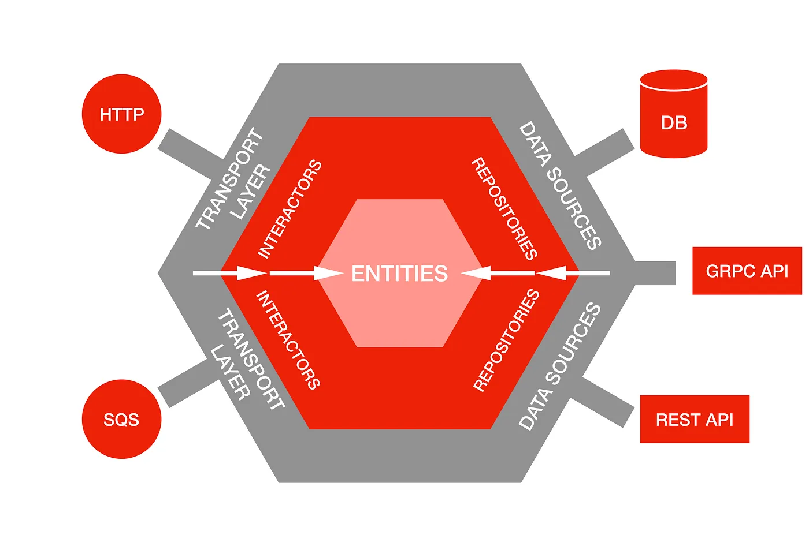

> If you prefer english, I recommend you to use immersive translation or google translate.

## 클린 아키텍처란?

출처: [NestJS and Project Structure - What to Do?](https://dev.to/smolinari/nestjs-and-project-structure-what-to-do-1223)


클린 아키텍처는 `Robert C. Martin(AKA uncle Bob)`에 의해 고안된 소프트웨어 아키텍처 패턴이다.
모든 아키텍처 스타일과 마찬가지로 유연하고 테스트하기 쉬우며 유지보수가 용이한 시스템을 만들기 위한 아키텍처 스타일이다.

구체적인 방법론이라기보다는 '이렇게 하면 좋더라'라는 가이드라인 내지는 철학의 집합에 가깝다.

## Layered Architecture

잠시 `Layered Architecture`에 대해 알아보자.

`Layered` 말 그대로 계층의 분리를 통해 관심사의 분리를 이루는 아키텍처 스타일이다. 공장의 각 라인마다 담당하는 역할이 다른 것과 유사하다.

3,4 계층은 아래와 같이 분류한다.

`3계층`
- Presentation Layer (UI Layer)
- Application/Business Logic Layer (Domain Layer)
- Data Access Layer (Infrastructure Layer)

`4계층`
- Presentation Layer (UI Layer)
- Business Logic Layer (Domain Layer)
- Persistence Layer (Repository Layer)
- Datasource Layer

3계층과 4계층의 차이는 Business Logic Layer와 Persistence Layer의 분리 여부이다.

- `3계층의 Application/Business Logic Layer`는 비즈니스 규칙과 DB에 대한 접근에 대한 역할을 모두 담당한다.
- `4계층의 Business Logic Layer`는 비즈니스 규칙에 대한 역할만 담당하고, `Persistence Layer`가 DB에 대한 접근을 담당한다.

`Nest.js`와 같은 프레임워크를 이용해 프로젝트를 초기 구성할때 [위와 같은 구성](https://github.com/nestjs/nest/tree/master/sample/01-cats-app)으로 프로젝트가 세팅된다.
`Spring` 등의 프레임워크를 이용하다보면 자연히 손과 눈에 익게되는 구조이기도 하다.

엉클밥은 레이어드 아키텍처는 자연스레 Database-centric한 설계를 유도하게 되므로 데이터베이스 의존성이 전파되는 등의 문제점이 있어 `Clean Architecture`를 고안하게 되었다고 한다.

## Clean Architecture


`Layered Architecture` 로는 무언가 부족했기에 그걸 개선한 `Clean Architecture`가 고안되었을 것이다.

레이어드 아키텍처의 핵심 문제 중 하나는 `상위 계층(비즈니스 로직)`이 `하위 계층(DB, UI)`에 직접적으로 의존하는 구조이다.

그로 인해 생기는 문제점은 아래와 같다.
- 하위 계층의 변경이 상위 계층에 파급 효과를 일으킨다.
- 특정 기술 스택에 대한 종속성이 높아진다.
- 시스템의 유연성과 테스트 용이성이 저해된다.

해결책은 `고수준 모듈(비즈니스 로직)`이 `저수준 모듈(데이터베이스 구현체, UI 구현체 등)`에 의존하지 않고, 양쪽 모두 추상화(인터페이스)에 의존하게 만드는 것이다.

레이어드 아키텍처로 4계층 레이어드 아키텍처를 단순하게 구현하면 아래와 같은 구조가 된다.
```typescript showLineNumbers {9}
export class UserRepository {
    async findUserById(id: number) {}
}

export class UserService {
    private userRepository: UserRepository;

    constructor(userRepository: UserRepository) {
        this.userRepository = userRepository;
    }
}
```

만약 이 상황에서 DB를 변경하고 싶다면, 위의 구조에서는 쉽지 않을것이다.
아래와 같은 구조에서는 추상화된 인터페이스를 통해 의존성을 주입받기 때문에, DB를 변경하는 것이 훨씬 수월하다.

~~GoF 디자인패턴의 추상xx 패턴이 생각난다.~~

```typescript showLineNumbers {14,17-18}
export interface IUserRepository {
  findUserById(id: number): Promise<null>;
}

// concrete.user.repository
export class ConcreteMongoUserRepository implements IUserRepository {
    async findUserById(id: number) {}
}

// 클린아키텍처 다이어그램의 use-case 계층. (사용례가 중요하지 계층별 이름을 그대로 사용하는것은 중요하지 않다고 생각하여 service 라는 이름을 사용하였다.)
// user.service
@Injectable()
export class UserService {
  private userRepository: IUserRepository; // 인터페이스에 의존

  constructor(
    @Inject('ConcreteMongoUserRepository')
    userRepository: IUserRepository
  ) {}
}
```

### Adapter
외부 세계와 내부 비즈니스 로직을 이어주는 다리 역할을 하는 친구다.
외부 시스템이 가지는 자체적인 모델과(API, DB) 내부 비즈니스 로직이 가지는 Entity 또는 VO(Value Object) 간의 변환을 담당한다.

아래와 같이 분류하기도 한다.
- Primary Adapters (Driving): 외부에서 애플리케이션을 호출 (Controller, CLI, Web API)
- Secondary Adapters (Driven): 애플리케이션이 외부를 호출 (Database, File System, External API)

## Hexagonal Architecture


port-and-adapter 패턴이라고도 불리는데, 기본 원칙들만 존재하는 클린아키텍처를 조금 더 구체화한 패턴이다. 프레임워크 느낌?

in & output 포트와 그 앞단의 Adapter를 이용해 입출력 응답에 대한 부분을 추상화하였다.

## 정리
클린 아키텍처 스타일에 대해 간략하게 정리해보았다.

개인적으로 클린 아키텍처 스타일이란건 요리 레시피에 더 가깝다고 생각하는데, 내 프로젝트가 어떤 성격인지에 대한 생각없이 좋다고 무작정 적용하다보면 라면가지고 코스요리 만드는 꼴을 볼 수 있다고 생각한다.
프로젝트의 구조를 변경해버리는 아키텍처 스타일의 변경을 도모할 때는 더더욱.

모든 아키텍처 스타일이 그렇듯 관리를 위해 복잡성을 올리는 형태이기 때문에 적절한 선에서 타협하는 것이 중요할 것 같다.

~~안 그러면 팀원들에게 욕이란 욕은 다 들어먹게 될 것이다.~~

## References
- [WSO2 아키텍쳐 레퍼런스](https://github.com/wso2/reference-architecture)

### Clean architecture
- [NHN FORWARD - 클린아키텍처 애매한 부분 정해드립니다.](https://www.youtube.com/watch?v=g6Tg6_qpIVc&ab_channel=NHNCloud)
- [서비스 레이어 분리에 대하여](https://jaeseo0519.tistory.com/380)
- [클린 아키텍처란?](https://k-elon.tistory.com/38)
- [요즘 핫한 Clean Architecture 왜 쓰는거야?](https://meetup.nhncloud.com/posts/345)
- [Clean Architecture](https://janechoi.tistory.com/79)
- ~~[nestjs clean architecture](https://v-checha.medium.com/building-enterprise-grade-nestjs-applications-a-clean-architecture-template-ebcb6462c692)~~
  - ~~[github](https://github.com/v-checha/nestjs-template/)~~
  - [NestJS and Project Structure - What to Do? 🔥](https://dev.to/smolinari/nestjs-and-project-structure-what-to-do-1223) 위 글을 읽고 아래 글을 읽는 것을 추천한다.
-[Onion Architecture 🔥](https://medium.com/expedia-group-tech/onion-architecture-deed8a554423)


### Hexagonal architecture
- [Ready for changes with Hexagonal Architecture](https://netflixtechblog.com/ready-for-changes-with-hexagonal-architecture-b315ec967749)
- [코드 사례로 보는 Domain-Driven 헥사고날 아키텍처](https://devblog.kakaostyle.com/ko/2025-03-21-1-domain-driven-hexagonal-architecture-by-example/)
- [Hexagonal Architecture](https://devocean.sk.com/blog/techBoardDetail.do?ID=165581)
