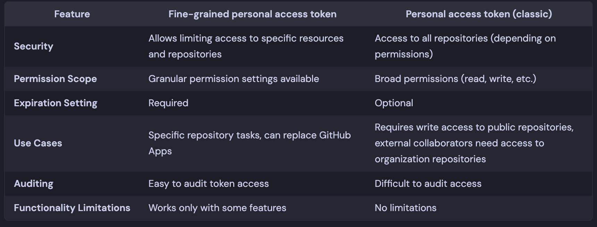
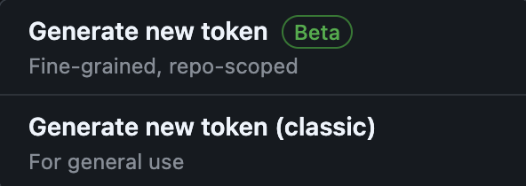
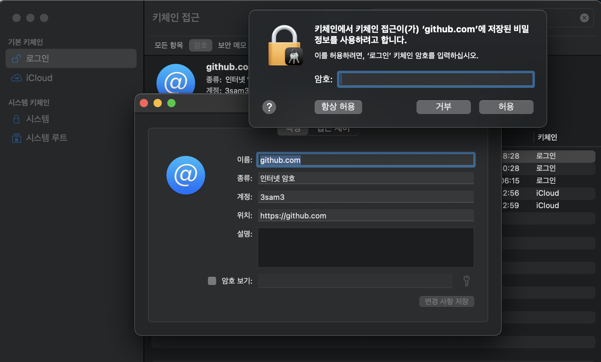

## Overview
```text
remote: Support for password authentication was removed on August 13, 2021. Please use a personal access token instead.
remote: Please see https://github.blog/2020-12-15-token-authentication-requirements-for-git-operations/ for more information.
```
There was a time when GitHub suddenly stopped supporting authentication using ID and password.
Since then, I've had to configure related settings multiple times, but I always forget how I did it and have to look it up again.
Now I need to set it up once more, and this time, I'm going to write a post about it so I don't forget.

## Personal Access Token
PAT is alternative to password. 

It doesn't grant access to the entire account, and it's safer because it has an expiration date and allows access only to the configured permissions.
Unless you didn't include all permissions and infinite expiration date.

### Fine-grained vs Classic


### How to Generate token
You can go to the page below to get it issued. 
The fine-grained token is still in beta, [so some features are not supported.](https://github.com/orgs/community/discussions/36441)

[Personal Access Tokens (Classic)](https://github.com/settings/tokens)


## How to extract token from keychain
If you forgot what your PAT is, You might able to extract from keychain. 



## Usage
### Package Registry
`read:packages` permission required.

```bash
# ~/.npmrc
//npm.pkg.github.com/:_authToken={{ YOUR_PAT_TOKEN }}
@{{ YOUR_PACKAGE_PREFIX }}:registry=https://npm.pkg.github.com/
```


## References
- [Token authentication requirements for Git operations - The GitHub Blog](https://github.blog/security/application-security/token-authentication-requirements-for-git-operations/)
- [Personal Access Tokens (Classic)](https://github.com/settings/tokens)
- [Fine-grained Personal Access Tokens](https://github.com/settings/personal-access-tokens)
- [[Feedback tracking] Fine-grained personal access tokens · community · Discussion #36441](https://github.com/orgs/community/discussions/36441)
