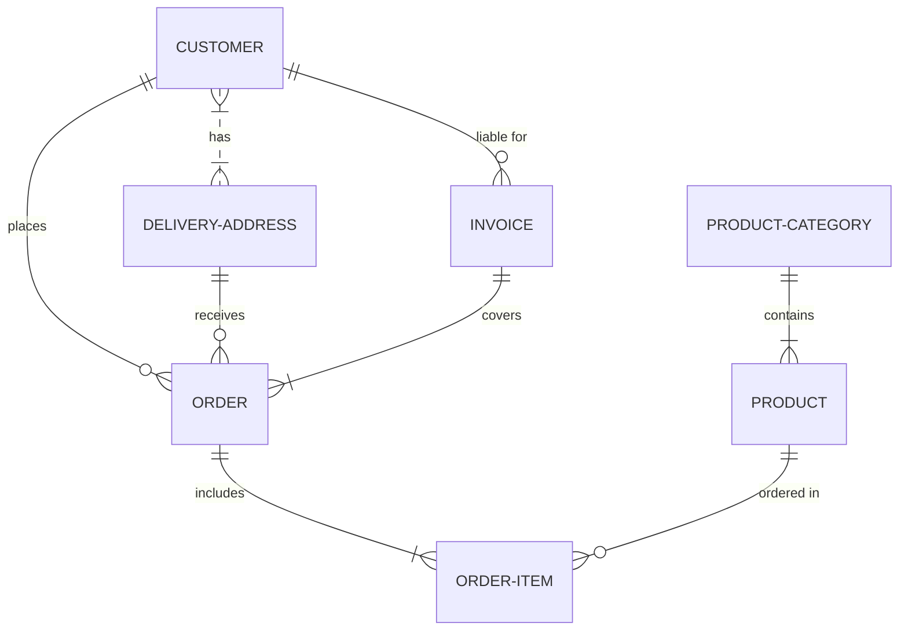

## Overview

> This Posting is about My first Look on Docusaurus functions


## Codeblock

### Show Line Number

```js showLineNumbers
export const formatDate = (date: string) => {
    const regex = /^(\d{4})(\d{2})(\d{2})$/;
    if(!date.match(regex)) {
        throw new Error('날짜 포맷에 맞지 않습니다.')
    }

    return date.replace(regex, '$1-$2-$3');
};
```

### Line Highlighting

```js showLineNumbers {2,7}
export const formatDate = (date: string) => {
    const regex = /^(\d{4})(\d{2})(\d{2})$/;
    if(!date.match(regex)) {
        throw new Error('날짜 포맷에 맞지 않습니다.')
    }

    return date.replace(regex, '$1-$2-$3');
};
```

### Error Highlighting

```js
const name = null;
// This will error
console.log(name.toUpperCase());
```

## Diagram

I personally prefer D2 diagram, but `Mermaid` is the only diagram docusaurus offers.




## Link

### Import Image


### Import Link

[This Image Link!](../static/img/docusaurus.png)

### Import Link

<iframe
  width="560"
  height="315"
  src="https://www.youtube.com/embed/kIyg9FZJebc?si=-YMim1vdyXDmjt0P"
  title="YouTube video player"
  frameborder="0"
  allow="accelerometer; autoplay; clipboard-write; encrypted-media; gyroscope; picture-in-picture; web-share"
  referrerpolicy="strict-origin-when-cross-origin"
  allowfullscreen
></iframe>
