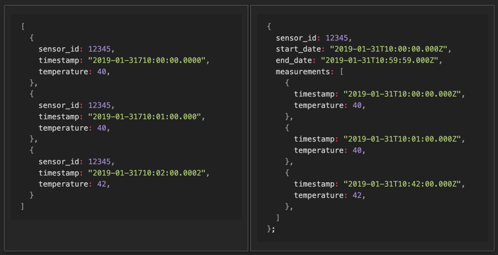

import HighlightOrange from "../../src/components/utils/highlight-orange";

## Before We Start

We must talk about what `Timeseries Data` is.

### Timeseries Data

> A time series is a sequence of data points collected or recorded at successive points in time, typically at uniform intervals.

`TimeseriesDB` is `Database` that stores `Timeseries Data`.

## How It differs from traditional DB?

> It's always better to see, rather than explaining

|  |  |
| :-----------------: | :-------------------------------: |
|     `normal DB`     |          `Timeseries DB`          |

## Features

> <HighlightOrange text="As you can see, It Indexes Data by Time range." /> \
> Every Pros and cons comes from this.

- Made for storing large set of data
- Stores data chunks by time range
- Optimized for `INSERT` & `SELECT`
  - Barely provides `DELETE` & `UPDATE`

## Bucket Pattern

Before Timeseries, There was `Schema Design Pattern`, `Bucket pattern`. \
Pretty much It is primitive version of Timeseries collection. \
I'll show you how to implement `Bucket pattern`.

> 

Normally, you'd store data like left image. \
indexing by id.

In `Bucket Pattern`, indexes data by `time(start_date, end_date)` and `sensor_id`.

This was efficient in `1:N relations`, but were some issues. \
If BSON size limit of 16 MB is exceeded, special handling needs to be performed, such as separating the loaded data and retrieving it again.

Starting from `MongoDB 5.x`, the support for `Time series collection` that internally implements the bucket pattern does the job for us.

## etc

You might wanna see how data is actually stored.

Take a look at `system.bucket.[COLLECTION_NAME]`.

```json
{
  "_id": "65d3eb80b6473e96f1b570c7",
  "control": {
    "version": 1,
    "min": {
      "_id": "65d418420498d3b000d19641",
      "timestamp": "2024-02-20T00:00:00.000Z",
      "data": {
        "value": 0.04303943091823581
      }
    },
    "max": {
      "_id": "65d418f00498d3b000d1964b",
      "timestamp": "2024-02-20T03:13:52.049Z",
      "data": {
        "value": 0.8827539992979445
      }
    }
  },
  "meta": {
    "id": "6093b741070ad40011cabbae",
    "key": "meta-data-you-set"
  },
  "data": {
    "_id": {
      "0": "65d418420498d3b000d19641",
      "1": "65d418ec0498d3b000d19642",
      "2": "65d418ed0498d3b000d19643",
      "3": "65d418ee0498d3b000d19644",
      "4": "65d418ee0498d3b000d19645",
      "5": "65d418ee0498d3b000d19646",
      "6": "65d418ee0498d3b000d19647",
      "7": "65d418ef0498d3b000d19648",
      "8": "65d418ef0498d3b000d19649",
      "9": "65d418ef0498d3b000d1964a",
      "10": "65d418f00498d3b000d1964b"
    },
    "timestamp": {
      "0": "2024-02-20T03:10:58.414Z",
      "1": "2024-02-20T03:13:48.823Z",
      "2": "2024-02-20T03:13:49.553Z",
      "3": "2024-02-20T03:13:50.025Z",
      "4": "2024-02-20T03:13:50.371Z",
      "5": "2024-02-20T03:13:50.671Z",
      "6": "2024-02-20T03:13:50.952Z",
      "7": "2024-02-20T03:13:51.272Z",
      "8": "2024-02-20T03:13:51.490Z",
      "9": "2024-02-20T03:13:51.738Z",
      "10": "2024-02-20T03:13:52.049Z"
    },
    "data": {
      "1": {
        "value": 0.6954380762758321
      },
      "2": {
        "value": 0.8276404308193761
      },
      "3": {
        "value": 0.06242745352637269
      },
      "4": {
        "value": 0.548645414603997
      },
      "5": {
        "value": 0.8495674421359376
      },
      "6": {
        "value": 0.04303943091823581
      },
      "7": {
        "value": 0.6313514590828619
      },
      "8": {
        "value": 0.8827539992979445
      },
      "9": {
        "value": 0.1477508498242106
      },
      "10": {
        "value": 0.818804826373378
      }
    }
  }
}
```

---

## Reference

- [Building with Patterns: The Bucket Pattern | MongoDB](https://www.mongodb.com/blog/post/building-with-patterns-the-bucket-pattern)
- [Paginations 1.0: Time Series Collections in five minutes | MongoDB](https://www.mongodb.com/developer/products/mongodb/paginations-time-series-collections-in-five-minutes/?tck=feathome)
- [MongoDB Windows functions and time-series performance | by Guy Harrison | MongoDB Performance Tuning | Medium](https://medium.com/mongodb-performance-tuning/mongodb-windows-function-and-time-series-performance-8d742addac34)
