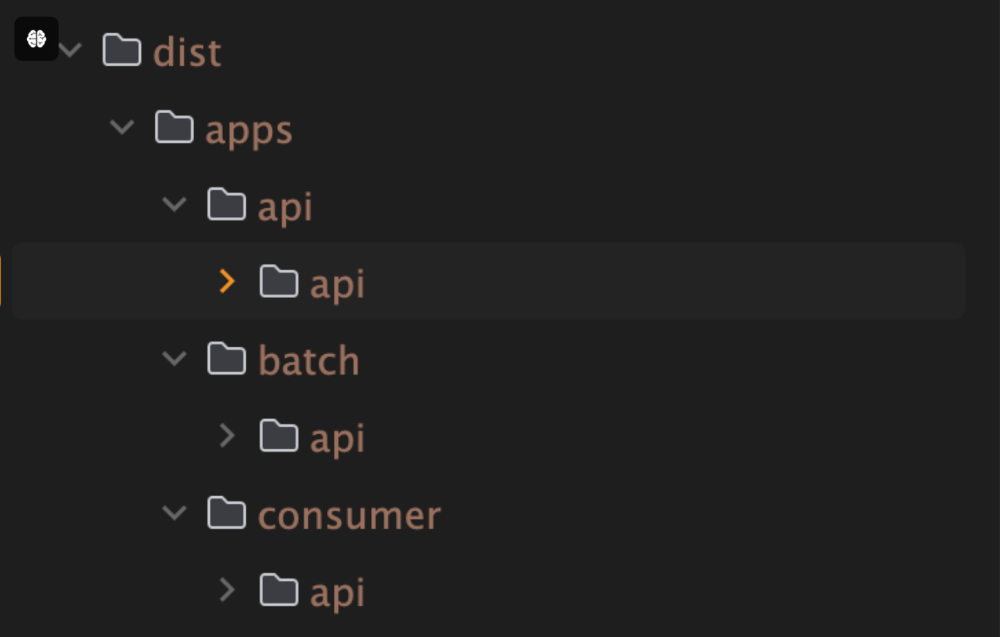
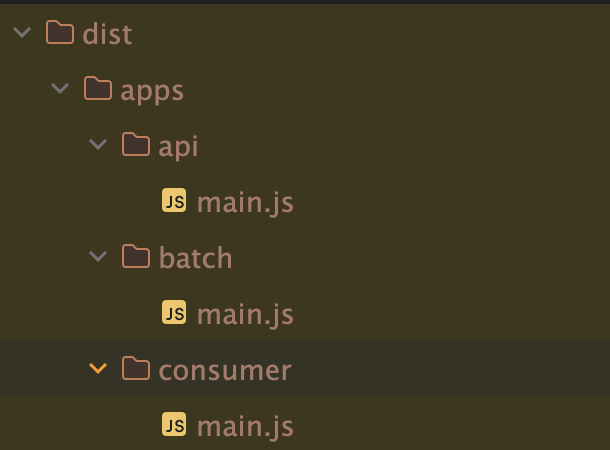

import HighlightOrange from "../../src/components/utils/highlight-orange";

## Overview


> There was release of version 10 in Nest.js this june.

There were some changes like

- _**Simple SWC support**_
- Module overriding feature in testing
- Redis wildcard subscription
- CacheModule separated from @nestjs/common to @nestjs/cache-manager

<HighlightOrange text="But, We're only going to talk about SWC" />

## About Integration

```bash showLineNumbers
npm i --save-dev @swc/cli @swc/core
nest start -b swc
```

Those code are all you need to do when using `SWC` builder. \
It's lightning fast when you use in standard mode.

## In Monorepo

> When It comes to Monorepo. It's not.

`Nest.js` provides monorepo mode. \
Let's Try `SWC`.

```json {4} showLineNumbers
// nest-cli.json
{
  "compilerOptions": {
    "builder": "swc", // this is equivalent to "-b swc" in cli
    "typeCheck": true,
    "deleteOutDir": false,
    "tsConfigPath": "apps/api/tsconfig.app.json"
  }
}
```

> This is what you'll get.
> 

This is due to `SWC` doesn't have a built-in modules resolution system. \
It only builds root project of your repository.

## Here come a Webpack

> Since webpack has module resolution, it's going to do job for us.

```json {4} showLineNumbers
// nest-cli.json
{
  "compilerOptions": {
    "builder": "webpack",
    "deleteOutDir": false,
    "tsConfigPath": "apps/api/tsconfig.app.json"
  }
}
```

> `SWC`
>
> > 

> `Webpack`
>
> > 

Of course, I configured a `swc-loader` in `webpack`.\
and I checked `swc` configuration was imported to `webpack`.

I'm not sure what's the problem. <HighlightOrange text="but with webpack, swc lost it's performance"/>

And One more thing.

> `Webpack` bundles your project files into a one big chunk.
>
> > 

If you're using `TypeORM` or `MikroORM`, and imports your entities like this, \
This will break your app.

There is a way to not to bundle your files by configuring entry and output of `webpack.config`. \
But, I won't recommend.

```ts {2,3} showLineNumbers
{
  entities: ['dist/**/*.entity.js', 'libs/**/*.entity.js'],
  entitiesTs: ['libs/**/*.entity.ts']
}
```

## My Conclusion

- Using `SWC` in `standard mode`: go for it.
- Using `SWC` in `monorepo mode`: <HighlightOrange text="Don't."/> unless you can make your own custom scripts that can manage all the problems

## Ref

- [Nest.js 10 announcement](https://trilon.io/blog/nestjs-10-is-now-available)
- [Nest.js Monorepo mode](https://docs.nestjs.com/cli/monorepo#monorepo-mode)
- [Nest.js SWC configuration](https://docs.nestjs.com/recipes/swc#cli-plugins-swc)
- [SWC monorepo issue](https://github.com/nestjs/nest/issues/12977)
