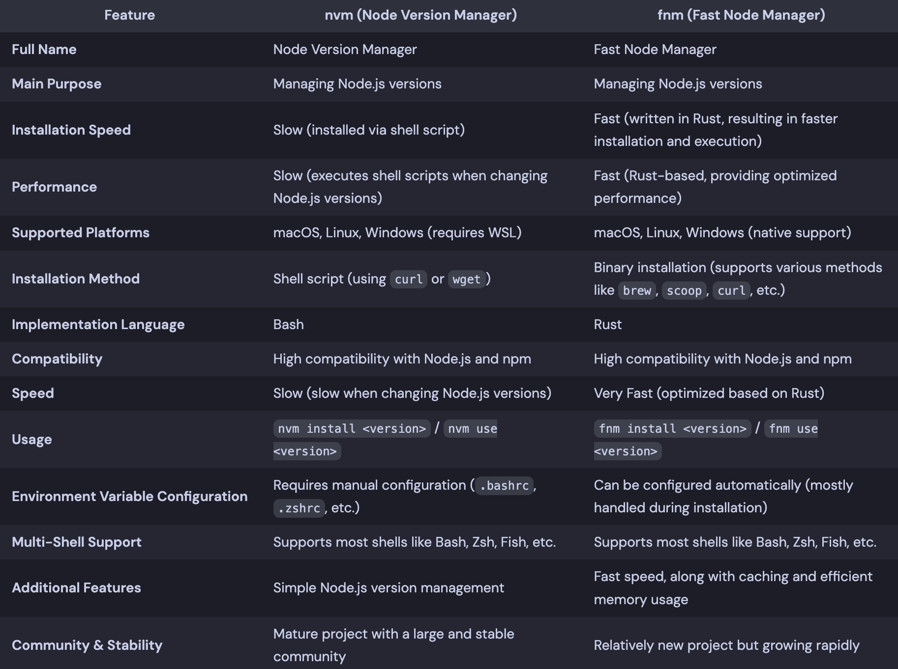

## Overview
A Node.js version manager is a tool that helps you easily switch between different Node.js versions. By using a Node.js version manager, you can use different Node.js versions for each project, which prevents Node.js version conflicts between projects.

I will introduce nvm and fnm below, but it doesn't matter which tool you use.

You probably don't install Node versions that often, and even if you do, there doesn't seem to be much difference. I think you can choose the tool that suits your taste or that you are familiar with

## NVM (Node Version Manager)
It is a commonly used Node.js version manager.

Compared to fnm, which I will introduce later, it doesn't have any particular functional advantages. However, it has the advantage of having significantly more references

### Installation
Run following script,
```bash
$ curl -o- https://raw.githubusercontent.com/nvm-sh/nvm/v0.40.1/install.sh | bash
```
Write following script to your shell configuration file, to load nvm module. 
```bash
# ~/.zshrc
export NVM_DIR="$HOME/.nvm"
[ -s "/opt/homebrew/opt/nvm/nvm.sh" ] && \. "/opt/homebrew/opt/nvm/nvm.sh"  # This loads nvm
[ -s "/opt/homebrew/opt/nvm/etc/bash_completion.d/nvm" ] && \. "/opt/homebrew/opt/nvm/etc/bash_completion.d/nvm"
```

## FNM (Fast Node Manager)
It is an improved Node.js version manager.

It's fast and has low memory usage. Furthermore, once installed, you don't need to configure environment variables or anything else.

### Installation

```bash
$ brew install fnm
```

## Comparison
 I made comparison table using chatGPT.


## References

- [nvm: Node Version Manager](https://github.com/nvm-sh/nvm)
- [Schniz fnm](https://github.com/Schniz/fnm)
