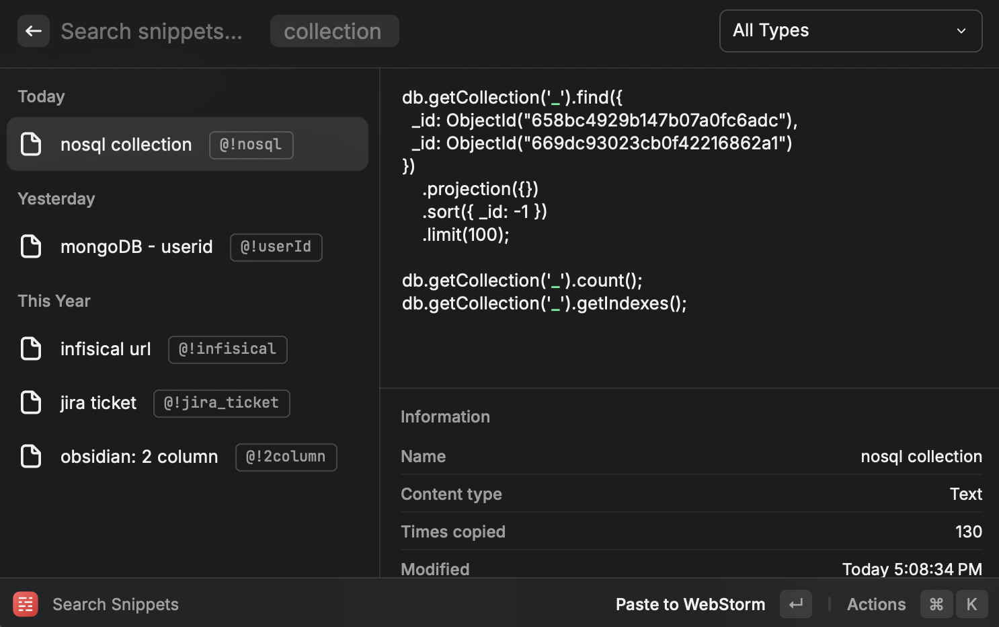
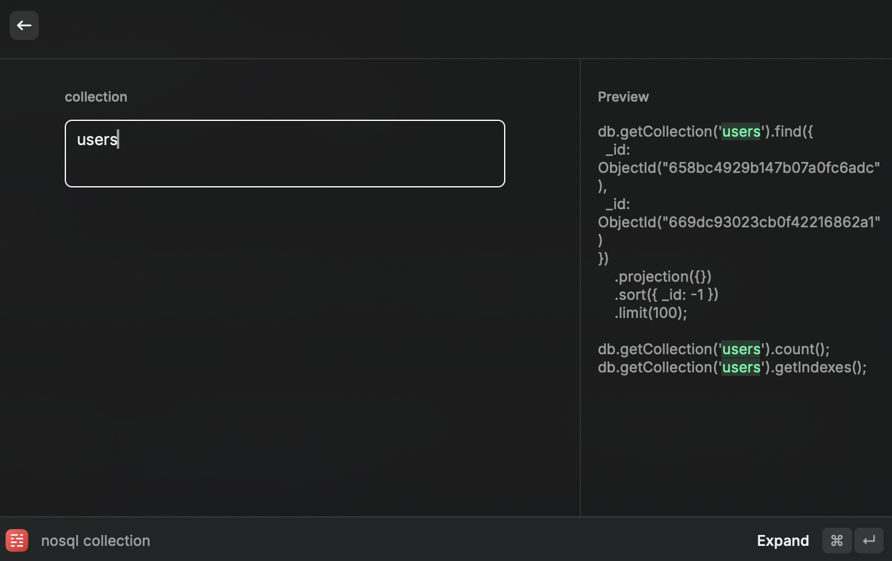
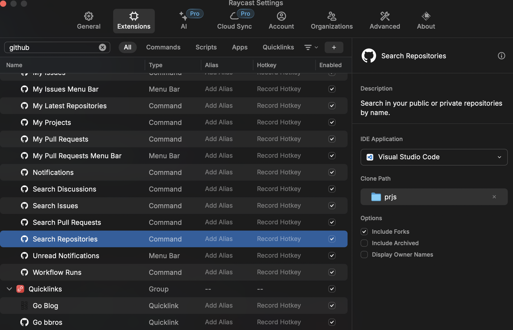
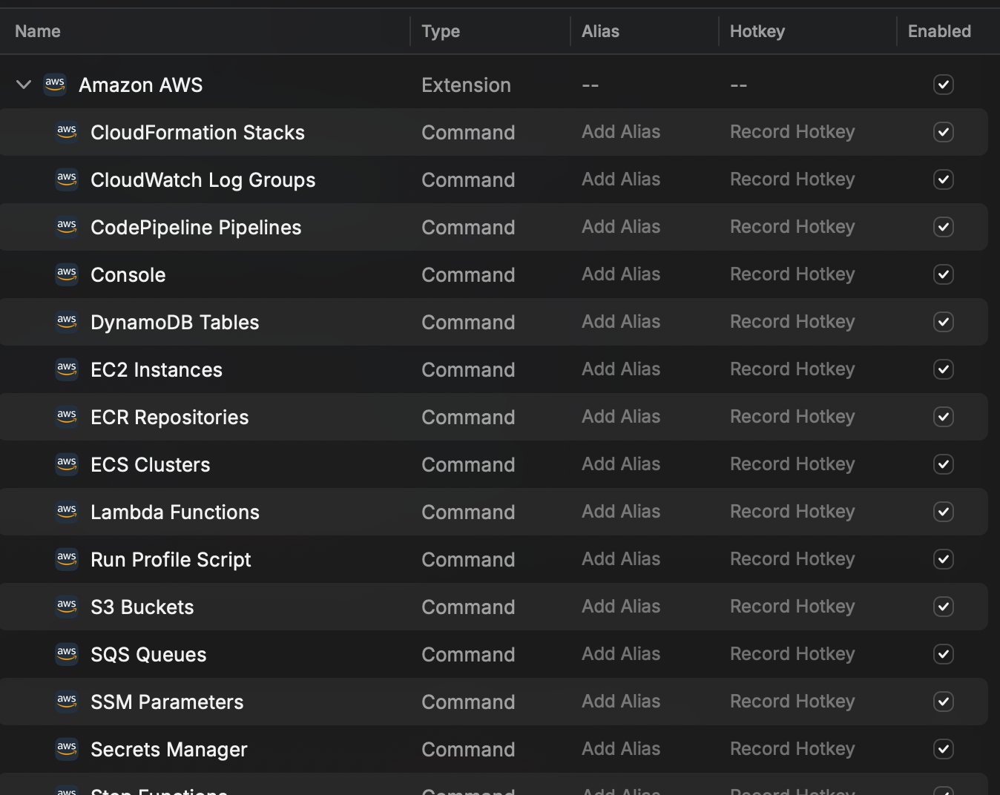
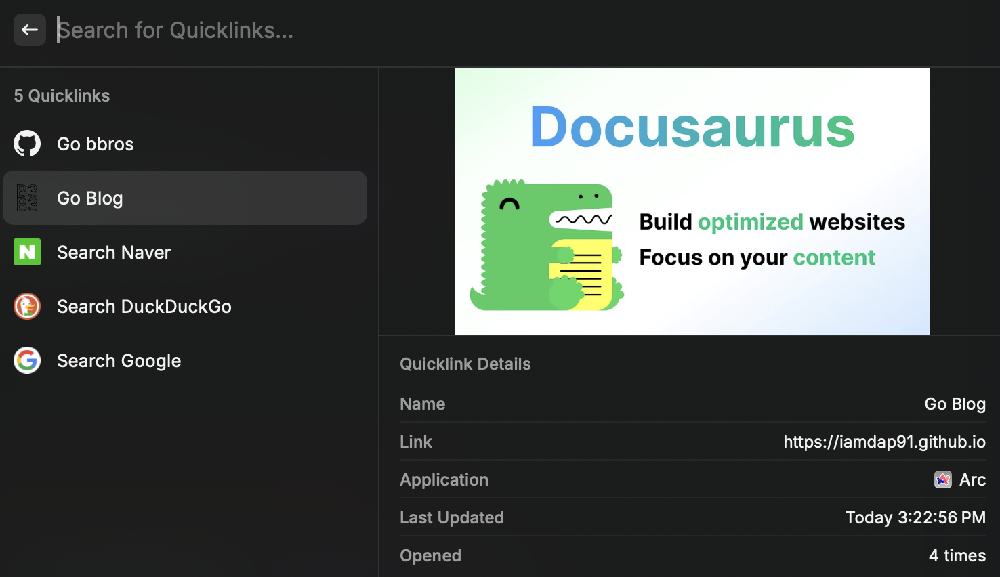

## Overview

> `Raycast` is `spotlight` substitute in `MacOS`

**I'm certain `Raycast` is Much more powerful than `spotlight`.**

Here are several super powerful features that `Raycast` provides.

Those will reduce repetitive tasks.

## Snippets 👑

> Down below is the snippets I use
> 

Almost all application provides snippets by themselves. but, they are bound to their app context.

`Raycast` is not.

### Usage

Do you see the words starts with `@!` in the small boxes? Those are `keywords` that triggers the snippet.

> for example, Everytime I type `@!nosql` anywhere, pop up kicks in.
> 
> Then Result would be
>
> ```js
> db.getCollection("users")
>   .find({
>     _id: ObjectId("658bc4929b147b07a0fc6adc"),
>     _id: ObjectId("669dc93023cb0f42216862a1"),
>   })
>   .projection({})
>   .sort({ _id: -1 })
>   .limit(100);
> db.getCollection("users").count();
> db.getCollection("users").getIndexes();
> ```

All I type was `@!nosql` and `users`. \
Awesome!

This gets really handy when you use your own `infisical server`. \
It requires server url everytime you login. \
I've set infisical server domain in snippet (`@!infisical`)

## Github 🏅

> If you're a computer developer, this is the one you want
> 

You can search your repositories and clone them at once!

**It only requires `Login` and nothing else.**

## Amazon AWS 🏅

> You can manage your AWS with in cli \
> personally, I use them to browse through aws web page
> 

I know It's pain in the ass everytime you move one page to another in AWS. \
Just use `console > [aws feature]`.

This make it much more easier to browse through AWS

## OCR 🥈

> [Documentation Link](https://www.raycast.com/Rafo94/easy-ocr)

This is the plugin that can be downloaded from `raycast store` (free)

You can easily read text from image with simple command. **(requires `tesseract` installation)**

## Quick Links 🥈

> I use this feature just like bookmark of browser. \
> It's good to use when you dont want to use mouse or trackpad
> 

This feature can make you go to page you've register. \
pretty much like bookmark of web browser.

## Reference

- [**Raycast Store**](https://www.raycast.com/store/trending/3#list)
