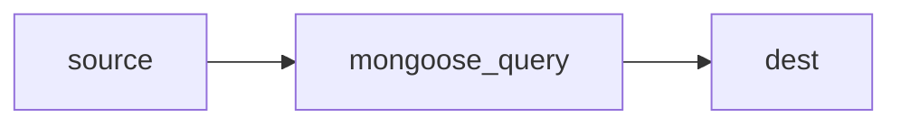

## source

```json showLineNumbers
{
  "Class_Grade": "b",
  "Homework_Grade": "c"
}
```

## process

```js showLineNumbers {4-13}
db.collection.updateMany(
  {},
  // *** Don't forget Array ***
  [
    {
      $set: {
        Grades: {
          Class_Grade: "$Class_Grade",
          Homework_Grade: "$Homework_Grade",
        },
      },
    },
  ],
);
```

## dest

```json showLineNumbers {2}
{
  "Grades": {
    "Class_Grade": "b",
    "Homework_Grade": "c"
  }
}
```
