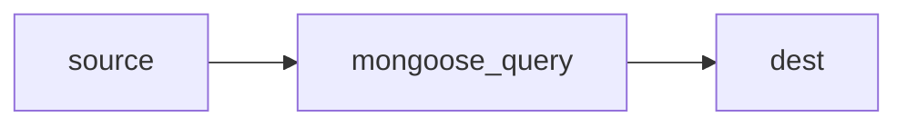

## source

```js
{
	"Class_Grade": "b"
	"Homework_Grade": "c"
}
```

## process

```js
db.collection.updateMany({}, [
  {
    $set: {
      Grades: {
        Class_Grade: "$Class_Grade",
        Homework_Grade: "$Homework_Grade",
      },
    },
  },
]);
```

## dest

```js
{
    "Grades": {
	    "Class_Grade": "b",
	    "Homework_Grade": "c"
    }
}
```
