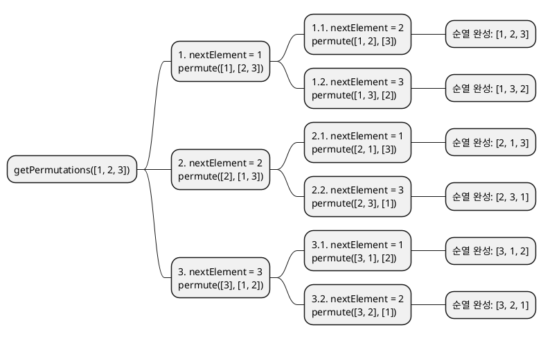

> If you prefer english, I recommend you to use immersive translation or google translate.

## 개요
서로 다른 n개의 원소에서 r개를 선택하여 나열하는 경우의 수


## 재귀
### 코드
```ts showLineNumbers
function getPermutations<T>(arr: T[]): T[][] {
    const result: T[][] = [];

    function permute(currentPermutation: T[], remainingElements: T[]) {
        if (remainingElements.length === 0) {
            result.push(currentPermutation);
            return;
        }

        for (let i = 0; i < remainingElements.length; i++) {
            const nextElement = remainingElements[i];
            const newRemainingElements = remainingElements.slice(0, i).concat(remainingElements.slice(i + 1));
            permute(currentPermutation.concat(nextElement), newRemainingElements);
        }
    }

    permute([], arr);
    return result;
}
```

기본적인 아이디어는 아래와 같다.
1. 남은 요소 중 하나를 선택하여 현재 순열에 추가
2. 나머지 요소들로 다시 순열을 생성 (재귀)
3. 모든 요소를 선택하면 순열 완성

### 시각화
> 실제 `[1, 2, 3]` 을 값으로 넣었다고 생각하고 따라가보자.

```kroki type=d2
direction: right
    vars: {
        d2-config.sketch: true
        arrow: {
        target-arrowhead: {
        shape: arrow
        }
    }
    dash: {
        style: {
        stroke-dash: 3
        animated: true
        }
    }
}

getPermutations: "getPermutations([1, 2, 3])"

root: "permute([], [1, 2, 3])"
getPermutations -> root: ${dash}

# 첫 번째 레벨
node1: "1. nextElement = 1\npermute([1], [2, 3])"
node2: "2. nextElement = 2\npermute([2], [1, 3])"
node3: "3. nextElement = 3\npermute([3], [1, 2])"

root -> node1: ${dash}
root -> node2: ${dash}
root -> node3: ${dash}

# 두 번째 레벨 - node1의 자식들
node1_1: "1.1. nextElement = 2\npermute([1, 2], [3])"
node1_2: "1.2. nextElement = 3\npermute([1, 3], [2])"

node1 -> node1_1: ${dash}
node1 -> node1_2: ${dash}

# 두 번째 레벨 - node2의 자식들
node2_1: "2.1. nextElement = 1\npermute([2, 1], [3])"
node2_2: "2.2. nextElement = 3\npermute([2, 3], [1])"

node2 -> node2_1: ${dash}
node2 -> node2_2: ${dash}

# 두 번째 레벨 - node3의 자식들
node3_1: "3.1. nextElement = 1\npermute([3, 1], [2])"
node3_2: "3.2. nextElement = 2\npermute([3, 2], [1])"

node3 -> node3_1: ${dash}
node3 -> node3_2: ${dash}

# 세 번째 레벨 - 최종 순열들
result1: "1.1.1. nextElement = 3\npermute([1, 2, 3], [])\n순열 완성: [1, 2, 3]"
result2: "1.2.1. nextElement = 2\npermute([1, 3, 2], [])\n순열 완성: [1, 3, 2]"
result3: "2.1.1. nextElement = 3\npermute([2, 1, 3], [])\n순열 완성: [2, 1, 3]"
result4: "2.2.1. nextElement = 1\npermute([2, 3, 1], [])\n순열 완성: [2, 3, 1]"
result5: "3.1.1. nextElement = 2\npermute([3, 1, 2], [])\n순열 완성: [3, 1, 2]"
result6: "3.2.1. nextElement = 1\npermute([3, 2, 1], [])\n순열 완성: [3, 2, 1]"

node1_1 -> result1: ${dash}
node1_2 -> result2: ${dash}
node2_1 -> result3: ${dash}
node2_2 -> result4: ${dash}
node3_1 -> result5: ${dash}
node3_2 -> result6: ${dash}

# 스타일링
getPermutations.style.fill: "#e1f5fe"
root.style.fill: "#f3e5f5"
node1.style.fill: "#e8f5e8"
node2.style.fill: "#e8f5e8"
node3.style.fill: "#e8f5e8"
result1.style.fill: "#fff3e0"
result2.style.fill: "#fff3e0"
result3.style.fill: "#fff3e0"
result4.style.fill: "#fff3e0"
result5.style.fill: "#fff3e0"
result6.style.fill: "#fff3e0"
```

<details>
    <summary>plantUML</summary>

</details>

<details>
    <summary>mermaid</summary>
    ```showLineNumbers
    graph TD
    A["getPermutations([1, 2, 3])<br/>permute([], [1, 2, 3])"] --> B["1. nextElement = 1<br/>permute([1], [2, 3])"]
    A --> C["2. nextElement = 2<br/>permute([2], [1, 3])"]
    A --> D["3. nextElement = 3<br/>permute([3], [1, 2])"]

    B --> E["1.1. nextElement = 2<br/>permute([1, 2], [3])"]
    B --> F["1.2. nextElement = 3<br/>permute([1, 3], [2])"]

    C --> G["2.1. nextElement = 1<br/>permute([2, 1], [3])"]
    C --> H["2.2. nextElement = 3<br/>permute([2, 3], [1])"]

    D --> I["3.1. nextElement = 1<br/>permute([3, 1], [2])"]
    D --> J["3.2. nextElement = 2<br/>permute([3, 2], [1])"]

    E --> K["순열 완성:<br/>[1, 2, 3]"]
    F --> L["순열 완성:<br/>[1, 3, 2]"]
    G --> M["순열 완성:<br/>[2, 1, 3]"]
    H --> N["순열 완성:<br/>[2, 3, 1]"]
    I --> O["순열 완성:<br/>[3, 1, 2]"]
    J --> P["순열 완성:<br/>[3, 2, 1]"]

    classDef root fill:#e1f5fe
    classDef level1 fill:#e8f5e8
    classDef level2 fill:#fff3e0
    classDef result fill:#ffebee

    class A root
    class B,C,D level1
    class E,F,G,H,I,J level2
    class K,L,M,N,O,P result
    ```
</details>
---

## 비재귀
### 코드
```typescript showLineNumbers
function getPermutationsIterative<T>(arr: T[]): T[][] {
    const result: T[][] = [];
    let currentPermutation = [...arr].sort(); // 시작은 정렬된 배열이어야 합니다.

    while (currentPermutation) {
        result.push([...currentPermutation]);
        currentPermutation = getNextPermutation(currentPermutation);
    }

    return result;
}

function getNextPermutation<T>(arr: T[]): T[] | null {
    const n = arr.length;
    let i = n - 2;

    // 1. 뒤에서부터 arr[i] < arr[i+1]을 만족하는 첫 번째 i를 찾습니다.
    // 이러한 i가 없으면, 배열은 마지막 순열입니다.
    while (i >= 0 && arr[i] >= arr[i + 1]) {
        i--;
    }

    if (i === -1) {
        return null; // 마지막 순열입니다.
    }

    // 2. 뒤에서부터 arr[j] > arr[i]을 만족하는 첫 번째 j를 찾습니다.
    let j = n - 1;
    while (arr[j] <= arr[i]) {
        j--;
    }

    // 3. arr[i]와 arr[j]를 교환합니다.
    [arr[i], arr[j]] = [arr[j], arr[i]];

    // 4. arr[i+1]부터 끝까지의 부분을 뒤집습니다.
    let left = i + 1;
    let right = n - 1;
    while (left < right) {
        [arr[left], arr[right]] = [arr[right], arr[left]];
        left++;
        right--;
    }

    return arr;
}
```

### 시각화
<details>
    <summary>프로세스</summary>
    ```kroki type=d2
    direction: down
    vars: {
    d2-config.sketch: true
    arrow: {
    target-arrowhead: {
    shape: arrow
}
}
    dash: {
    style: {
    stroke-dash: 3
    animated: true
}
}
}

    # 메인 함수 흐름
    main_flow: {
    start: "시작\n배열 정렬" {
    shape: oval
    style.fill: "#e1f5fe"
}

    check: "현재 순열이\n존재하는가?" {
    shape: diamond
    style.fill: "#fff3e0"
}

    add: "결과에\n현재 순열 추가" {
    shape: rectangle
    style.fill: "#f3e5f5"
}

    next: "다음 순열\n생성" {
    shape: rectangle
    style.fill: "#e8f5e8"
}

    end: "완료\n모든 순열 반환" {
    shape: oval
    style.fill: "#ffebee"
}

    start -> check
    check -> add: "Yes"
    add -> next
    next -> check
    check -> end: "No (null)"
}

    # 다음 순열 생성 알고리즘
    next_perm: {
    step1: "1단계: 피벗 찾기\n뒤에서부터 arr[i] < arr[i+1]\n인 첫 번째 i 찾기" {
    shape: rectangle
    style.fill: "#e3f2fd"
}

    check_pivot: "피벗을 찾았는가?\n(i >= 0)" {
    shape: diamond
    style.fill: "#fff8e1"
}

    step2: "2단계: 교환할 원소 찾기\n뒤에서부터 arr[j] > arr[i]\n인 첫 번째 j 찾기" {
    shape: rectangle
    style.fill: "#e8f5e8"
}

    step3: "3단계: 교환\narr[i] ↔ arr[j]" {
    shape: rectangle
    style.fill: "#fce4ec"
}

    step4: "4단계: 뒤집기\narr[i+1]부터 끝까지\n순서 뒤집기" {
    shape: rectangle
    style.fill: "#f3e5f5"
}

    return_null: "null 반환\n(마지막 순열)" {
    shape: oval
    style.fill: "#ffcdd2"
}

    return_arr: "새로운 순열 반환" {
    shape: oval
    style.fill: "#c8e6c9"
}

    step1 -> check_pivot
    check_pivot -> return_null: "No (i = -1)"
    check_pivot -> step2: "Yes"
    step2 -> step3
    step3 -> step4
    step4 -> return_arr
}

    # 연결선
    main_flow.next -> next_perm.step1: "호출"
    next_perm.return_arr -> main_flow.check: "반환"
    next_perm.return_null -> main_flow.check: "반환"
    ```
</details>
<details>
    <summary>[1, 2, 3] 예제</summary>
    ```kroki type=d2
    # 초기 상태
    initial: {
    input: "입력: [1,2,3]" {
    shape: rectangle
    style.fill: "#e3f2fd"
}

    sorted: "정렬된 배열: [1,2,3]" {
    shape: rectangle
    style.fill: "#e8f5e8"
}

    result: "결과 배열: []" {
    shape: rectangle
    style.fill: "#fff3e0"
}

    input -> sorted
    sorted -> result
}

    # 첫 번째 순열
    step1: {
    current1: "현재: [1,2,3]" {
    shape: rectangle
    style.fill: "#e1f5fe"
}

    add1: "결과에 추가\nresult = [[1,2,3]]" {
    shape: rectangle
    style.fill: "#f3e5f5"
}

    analysis1: "다음 순열 찾기:\n• i=1 (arr[1]=2 < arr[2]=3)\n• j=2 (arr[2]=3 > arr[1]=2)\n• 교환: 2 ↔ 3\n• 뒤집기: [3] → [3]" {
    shape: rectangle
    style.fill: "#fff8e1"
}

    next1: "다음 순열: [1,3,2]" {
    shape: rectangle
    style.fill: "#c8e6c9"
}

    current1 -> add1
    add1 -> analysis1
    analysis1 -> next1
}

    # 두 번째 순열
    step2: {
    current2: "현재: [1,3,2]" {
    shape: rectangle
    style.fill: "#e1f5fe"
}

    add2: "결과에 추가\nresult = [[1,2,3], [1,3,2]]" {
    shape: rectangle
    style.fill: "#f3e5f5"
}

    analysis2: "다음 순열 찾기:\n• i=0 (arr[0]=1 < arr[1]=3)\n• j=2 (arr[2]=2 > arr[0]=1)\n• 교환: 1 ↔ 2\n• 뒤집기: [3,1] → [1,3]" {
    shape: rectangle
    style.fill: "#fff8e1"
}

    next2: "다음 순열: [2,1,3]" {
    shape: rectangle
    style.fill: "#c8e6c9"
}

    current2 -> add2
    add2 -> analysis2
    analysis2 -> next2
}

    # 세 번째 순열
    step3: {
    current3: "현재: [2,1,3]" {
    shape: rectangle
    style.fill: "#e1f5fe"
}

    add3: "결과에 추가\nresult = [[1,2,3], [1,3,2], [2,1,3]]" {
    shape: rectangle
    style.fill: "#f3e5f5"
}

    analysis3: "다음 순열 찾기:\n• i=1 (arr[1]=1 < arr[2]=3)\n• j=2 (arr[2]=3 > arr[1]=1)\n• 교환: 1 ↔ 3\n• 뒤집기: [1] → [1]" {
    shape: rectangle
    style.fill: "#fff8e1"
}

    next3: "다음 순열: [2,3,1]" {
    shape: rectangle
    style.fill: "#c8e6c9"
}

    current3 -> add3
    add3 -> analysis3
    analysis3 -> next3
}

    # 네 번째 순열
    step4: {
    current4: "현재: [2,3,1]" {
    shape: rectangle
    style.fill: "#e1f5fe"
}

    add4: "결과에 추가\nresult = [[1,2,3], [1,3,2], [2,1,3], [2,3,1]]" {
    shape: rectangle
    style.fill: "#f3e5f5"
}

    analysis4: "다음 순열 찾기:\n• i=0 (arr[0]=2 < arr[1]=3)\n• j=1 (arr[1]=3 > arr[0]=2)\n• 교환: 2 ↔ 3\n• 뒤집기: [2,1] → [1,2]" {
    shape: rectangle
    style.fill: "#fff8e1"
}

    next4: "다음 순열: [3,1,2]" {
    shape: rectangle
    style.fill: "#c8e6c9"
}

    current4 -> add4
    add4 -> analysis4
    analysis4 -> next4
}

    # 다섯 번째 순열
    step5: {
    current5: "현재: [3,1,2]" {
    shape: rectangle
    style.fill: "#e1f5fe"
}

    add5: "결과에 추가\nresult = [[1,2,3], [1,3,2], [2,1,3], [2,3,1], [3,1,2]]" {
    shape: rectangle
    style.fill: "#f3e5f5"
}

    analysis5: "다음 순열 찾기:\n• i=1 (arr[1]=1 < arr[2]=2)\n• j=2 (arr[2]=2 > arr[1]=1)\n• 교환: 1 ↔ 2\n• 뒤집기: [1] → [1]" {
    shape: rectangle
    style.fill: "#fff8e1"
}

    next5: "다음 순열: [3,2,1]" {
    shape: rectangle
    style.fill: "#c8e6c9"
}

    current5 -> add5
    add5 -> analysis5
    analysis5 -> next5
}

    # 마지막 순열
    step6: {
    current6: "현재: [3,2,1]" {
    shape: rectangle
    style.fill: "#e1f5fe"
}

    add6: "결과에 추가\nresult = [[1,2,3], [1,3,2], [2,1,3], [2,3,1], [3,1,2], [3,2,1]]" {
    shape: rectangle
    style.fill: "#f3e5f5"
}

    analysis6: "다음 순열 찾기:\n• i=-1 (피벗 없음)\n• 내림차순 배열이므로\n  마지막 순열" {
    shape: rectangle
    style.fill: "#ffcdd2"
}

    final: "null 반환\n알고리즘 종료" {
    shape: oval
    style.fill: "#ffebee"
}

    current6 -> add6
    add6 -> analysis6
    analysis6 -> final
}

    # 연결선
    initial -> step1
    step1 -> step2
    step2 -> step3
    step3 -> step4
    step4 -> step5
    step5 -> step6
    ```
</details>


## Ref
- [nayuki.io](https://www.nayuki.io/page/next-lexicographical-permutation-algorithm)


