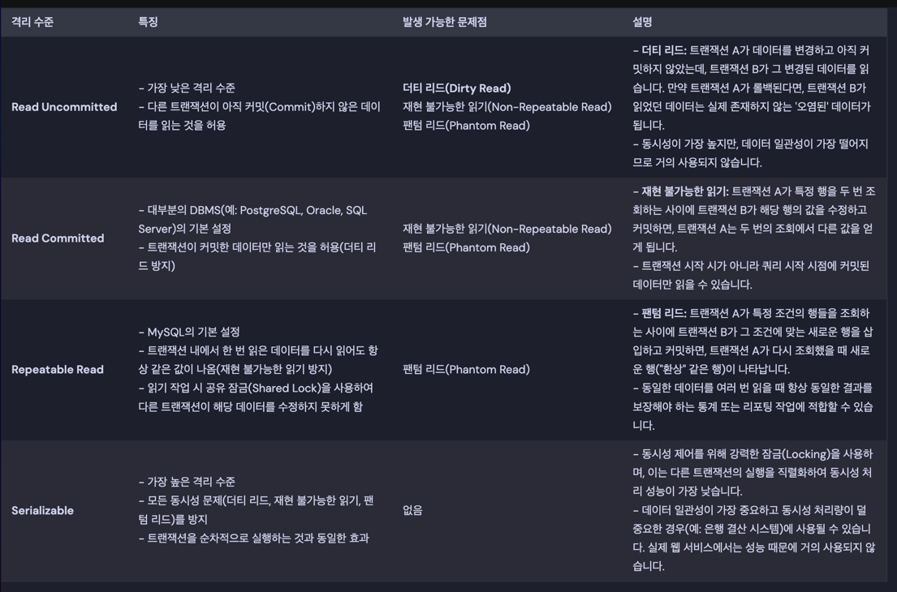

## **Node.js**

### 이벤트 루프

`non-blocking I/O`를 구현하기 위한 매커니즘.

이벤트루프는 콜스택을 모니터링한다. 콜스택이 비어있다면 마이크로태스트 큐와 태스크 큐에 콜백이 있는지 확인하고 있다면, 콜스택으로 옮긴 후 실행한다.
마이크로태스크 큐의 작업이 태스크 큐의 작업보다 실행순위가 더 높다.

### Closure

두 함수간 조합.
내부 함수가 외부 함수의 실행 종로 이후에도 그 속성값을 참조할 수 있다.

### Promise, async, await

Promise는 비동기 작업이 성공 또는 실패했는지 상태를 나타낸다.
Promise를 사용하면 비동기 코드를 더 동기적인 구문으로 작성할 수 있어, 훨씬 쉽게 읽고 관리할 수 있다.

### Type vs Interface

| 특징                  | `interface`               | `type`                                  |
|:--------------------|:--------------------------|:----------------------------------------|
| **선언적 병합**          | 가능 (동일 이름으로 여러 번 선언 시 병합) | 불가능 (동일 이름으로 여러 번 선언 시 오류)              |
| **구현 (implements)** | 클래스가 `implements` 할 수 있음  | 클래스가 `implements` 할 수 없음                |
| **확장 (extends)**    | `extends` 키워드로 확장 가능      | 인터섹션 타입 (`&`)을 사용하여 유사하게 결합 가능          |
| **용도**              | 주로 객체의 모양 정의, 클래스 구현 계약   | 객체, 프리미티브, 유니온, 튜플, 함수 시그니처 등 다양한 타입 정의 |
| **재귀적 타입**          | 직접적인 재귀 타입 정의에 제한이 있음     | 재귀적인 타입 정의에 더 유연함 (예: 연결 리스트)           |
| **타입 변환**           | 주로 명시적 객체 타입에 사용          | 다양한 타입 변환 및 조합에 유용 (예: Mapped Types)    |

### Scope

변수와 함수에 접근할 수 있는 범위

| 유형     | 정의 방식/특징                                                                | 접근 범위                                                           | 주요 키워드/메커니즘                              |
|:-------|:------------------------------------------------------------------------|:----------------------------------------------------------------|:-----------------------------------------|
| **전역** | `global` 객체의 속성으로 직접 할당되거나, Node.js 내장 전역 객체 (ex: `console`, `process`) | Node.js 프로세스 내의 모든 모듈에서 직접 접근 가능                                | `global` 객체, 내장 전역 변수/함수                 |
| **모듈** | 모든 Node.js 파일 자체의 최상위 스코프. 파일이 함수 래퍼로 감싸져 실행됨.                          | 해당 파일(`모듈`) 내에서만 직접 접근 가능. 다른 모듈에서 사용하려면 `export`/`require` 필요. | `module.exports`, `exports`, `require()` |
| **함수** | 함수 내부에 선언된 변수나 함수.                                                      | 해당 함수 내부에서만 접근 가능. 외부에서는 접근 불가능.                                | `var`, 함수 선언                             |
| **블록** | `{}` (중괄호)로 묶인 코드 블록 내부.                                                | 해당 블록 내부에서만 접근 가능. 블록 외부에서는 접근 불가능.                             | `let`, `const`                           |

### Hoisting

JavaScript에서 변수 및 함수 선언이 스코프의 맨 위로 "끌어 올려지는" 것처럼 동작하는 현상.
변수 선언 방식에 따라 호이스팅의 동작 방식이 다름.

| 구분          | `var` 변수                     | `let`, `const` 변수                          | 함수 선언문 (`function`)                       | 함수 표현식 (`var fn = function(){}`)              |
|:------------|:-----------------------------|:-------------------------------------------|:------------------------------------------|:----------------------------------------------|
| **호이스팅 여부** | O                            | O (하지만 초기화되지 않음)                           | O (함수 전체가 호이스팅됨)                          | O (변수 선언만 호이스팅됨)                              |
| **초기화 방식**  | 선언과 함께 `undefined`로 자동 초기화   | 초기화되지 않음 (`uninitialized`)                 | 함수 선언 자체가 메모리에 로드됨                        | 변수 선언만 `undefined`로 초기화됨                      |
| **접근 시점**   | 선언 전에 접근 가능 (값은 `undefined`) | 선언 전에 접근 시 `ReferenceError` (TDZ) 발생       | 선언 전에 접근 가능 (정상적으로 호출 가능)                 | 선언 전에 접근 시 `undefined` (TypeError 발생 가능성)     |
| **스코프**     | 함수 스코프 (또는 전역 스코프)           | 블록 스코프                                     | 함수 스코프 (또는 전역 스코프)                        | 변수의 스코프 규칙을 따름 (`var`는 함수, `let`/`const`는 블록) |
| **재할당/재선언** | 재할당/재선언 모두 가능                | 재할당 가능 (`let`), 재할당 불가능 (`const`), 재선언 불가능 | 재선언 시 덮어쓰기 (`var`와 유사), 함수 스코프 내에서 유일해야 함 | 변수의 규칙을 따름                                    |
| **모범 사례**   | 가급적 사용 지양                    | 변수 선언 시 기본 사용 (안정성과 예측 가능성 높음)             | 일반적인 함수 정의 시 사용                           | 콜백, 클로저 등 변수에 할당하여 함수 정의 시 사용                 |

### Prototype

모든 객체가 자신을 생성한 생성자의 prototype 객체를 참조하고, 이 참조들을 통해 상속 관계가 형성되는 "프로토타입 체인"을 형성하여 속성과 메서드를 공유하고 재사용하는 구조.

---

## `RESTful API`

### HTTP

HTTP (HyperText Transfer Protocol)는 웹에서 데이터를 주고받는 데 사용되는 애플리케이션 계층 프로토콜.

- `클라이언트-서버 모델`: 클라이언트(일반적으로 웹 브라우저)가 서버(웹 서버)에게 요청(Request)을 보내고, 서버가 해당 요청에 대한 응답(Response)을 보내는 방식으로 작동.
- `무상태성 (Stateless)`: 각 요청은 독립적이며, 이전 요청의 상태를 서버가 기억하지 않음.
- `비연결성 (Connectionless)`: `HTTP 1.0` 이전에는 클라이언트가 요청을 보내고 서버가 응답을 보내면 연결을 즉시 끊었으나, `HTTP 1.1`부터 `Keep-Alive` 기능을 이용하여 한
  번 맺은 연결을 재활용하여 여러 요청을 처리할 수 있게됨.

### HTTPS

HTTP는 기본적으로 암호화되지 않아 보안에 취약함.

HTTPS는 HTTP에 SSL/TLS 프로토콜을 사용하여 데이터를 암호화하고, 서버 인증을 통해 데이터의 무결성과 기밀성을 보장.

### SSL, TLS

| 특징        | SSL (Secure Sockets Layer)                  | TLS (Transport Layer Security)           |
|:----------|:--------------------------------------------|:-----------------------------------------|
| **정의**    | 웹 통신 암호화를 위해 Netscape에서 개발한 최초의 프로토콜        | SSL의 후속 버전으로, IETF에서 표준화한 현재의 암호화 프로토콜   |
| **버전**    | SSL 1.0, 2.0, 3.0                           | TLS 1.0, 1.1, 1.2, 1.3 (최신)              |
| **현재 사용** | **보안 취약점 때문에 사용 권장하지 않음 (대부분 폐기)**          | **현재 인터넷 통신의 표준 암호화 프로토콜 (널리 사용됨)**      |
| **기반 기술** | 초기 암호화 기술                                   | SSL 3.0을 기반으로 보안 및 성능 개선                 |
| **용어 혼용** | "SSL 인증서" 등 관습적으로 여전히 사용되는 경우가 많음           | 실제 사용되는 프로토콜이지만, "SSL"이라는 용어에 가려지기도 함    |
| **보안 수준** | 취약점이 발견되어 낮은 보안 수준                          | SSL보다 향상된 보안, 더 강력한 암호화 알고리즘 제공          |
| **주요 기능** | **암호화, 데이터 무결성, 서버 인증** (TLS와 동일한 기본 기능 제공) | **암호화, 데이터 무결성, 서버 인증** (기능 강화 및 효율성 증대) |
| **핸드셰이크** | 초기 버전의 핸드셰이크 과정                             | 개선된 핸드셰이크 과정 (특히 TLS 1.3에서 간소화 및 고속화)    |
| **적용 분야** | 과거의 HTTPS                                   | 현재의 HTTPS, 이메일, VPN 등 다양한 네트워크 통신        |

---

## 인증, 보안

### JWT

JWT (JSON Web Token)는 웹 표준(RFC 7519)으로, 당사자 간에 정보를 JSON 객체 형태로 안전하게 전송하기 위한 방법.
주로 인증(Authentication) 및 권한 부여(Authorization)를 위해 사용됨.

- **구성 요소**: JWT는 세 부분으로 구성됨
- **헤더(Header)**: 토큰의 유형과 해싱 알고리즘 정보를 포함.
- **페이로드(Payload)**: 토큰에 담길 클레임(Claims) 정보를 포함. 클레임은 등록된 클레임(iss, exp 등), 공개 클레임, 비공개 클레임으로 나뉨.
- **서명(Signature)**: 헤더와 페이로드를 인코딩한 후 비밀 키로 서명하여 토큰의 무결성을 보장.

### JWT vs Session

| 특징         | JWT (JSON Web Token)                 | 세션 (Session)                          |
|:-----------|:-------------------------------------|:--------------------------------------|
| **상태 저장**  | **무상태 (Stateless)**: 서버가 토큰을 저장하지 않음 | **상태 저장 (Stateful)**: 서버가 사용자 세션을 저장함 |
| **정보 저장**  | 토큰 자체 (페이로드)에 정보 포함                  | 서버의 세션 저장소에 정보 저장 (클라이언트는 세션 ID만 가짐)  |
| **확장성**    | 분산 시스템에 유리, 서버 간 데이터 공유 용이           | 서버 간 세션 공유를 위한 추가적인 인프라 필요            |
| **서버 부하**  | 검증만으로 사용자 정보 확인 가능, DB 조회 불필요        | 매 요청마다 세션 저장소 조회 필요                   |
| **보안**     | 토큰 탈취 시 위험, 페이로드 노출 주의               | 세션 하이재킹 위험, 서버가 관리하므로 상대적으로 안전        |
| **토큰 무효화** | 즉시 무효화 어려움, 만료 시점까지 유효               | 서버에서 즉시 무효화 가능                        |

### Cookie vs Session

HTTP 프로토콜은 기본적으로 상태를 저장하지 않는(Stateless) 특징을 가지고 있어, 사용자 로그인 정보나 장바구니 내용 등 연속적인 요청에서 정보를 유지하기 어려움.

세션과 쿠키는 이러한 HTTP의 한계를 보완하기 위해 사용됨.

| 특징        | 쿠키 (Cookie)                         | 세션 (Session)                      |
|:----------|:------------------------------------|:----------------------------------|
| **저장 위치** | 클라이언트 (브라우저)                        | 서버                                |
| **보안**    | 취약 (클라이언트 노출, 변조 가능성)               | 상대적으로 안전 (클라이언트에는 세션 ID만 노출)      |
| **용량**    | 작음 (약 4KB 제한)                       | 서버 자원이 허용하는 한도 (거의 무제한)           |
| **속도**    | 서버에 부하를 주지 않아 빠름                    | 서버에 부하 발생 가능성 (데이터 조회, 저장)        |
| **만료 시점** | 만료일 지정 또는 브라우저 종료 시                 | 브라우저 종료 또는 서버 설정된 타임아웃 경과 시       |
| **활용 예시** | 로그인 유지, 사용자 환경 설정, 장바구니(비회원), 광고 추적 | 로그인 정보, 장바구니(회원), 보안 정보, 다단계 프로세스 |

### CORS

CORS (Cross-Origin Resource Sharing)는 브라우저가 교차 출처 요청에 대한 응답에 액세스하는 것을 차단하는지 여부를 결정하는 HTTP 헤더 전송으로 구성된 시스템이다.

### XSS

XSS(Cross-Site Scripting)는 웹 보안 취약점 중 하나로, 공격자가 악성 스크립트(주로 JavaScript)를 웹 사이트에 삽입하여 사용자 측에서 실행되도록 하는 공격 기법.

### CSRF

CSRF(Cross-Site Request Forgery)는 "교차 사이트 요청 위조"라는 의미로, 공격자가 피해자의 웹 브라우저가 특정 웹사이트에 대해 위조된 요청을 보내도록 유도하는 공격 기법.

즉, 피해자가 로그인한 상태를 악용하여, 피해자도 모르게 공격자가 의도한 행위(예: 비밀번호 변경, 송금, 게시글 작성 등)를 수행하게 만드는 공격.

### SQL Injection

SQL Injection은 웹 보안 취약점 중 하나로, 공격자가 웹 애플리케이션의 입력 필드에 악의적인 SQL 코드(구문)를 삽입하여 데이터베이스를 조작하는 공격 기법.

---

## **OOP**

### SOLID Principle

- `S`: 단일 책임 원칙 (Single Responsibility Principle, SRP): 클래스는 단 하나의 변경 이유만 가져야 합니다. 즉, 클래스는 하나의 기능에만 집중해야 합니다.
- `O`: 개방-폐쇄 원칙 (Open-Closed Principle, OCP): 소프트웨어 개체(클래스, 모듈, 함수 등)는 확장에 대해 열려 있어야 하지만 수정에 대해서는 닫혀 있어야 합니다. 기존 코드를
  변경하지 않고도 새로운 기능을 추가할 수 있어야 합니다.
- `L`: 리스코프 치환 원칙 (Liskov Substitution Principle, LSP): 서브타입은 언제나 자신의 기반 타입(슈퍼타입)으로 교체할 수 있어야 합니다. 즉, 자식 클래스는 부모 클래스의
  기능을 올바르게 수행할 수 있어야 합니다.
- `I`: 인터페이스 분리 원칙 (Interface Segregation Principle, ISP): 클라이언트는 자신이 사용하지 않는 인터페이스에 의존해서는 안 됩니다. 즉, 거대한 단일 인터페이스보다는 여러
  개의 작은 인터페이스가 낫습니다.
- `D`: 의존성 역전 원칙 (Dependency Inversion Principle, DIP): 고수준 모듈은 저수준 모듈에 의존해서는 안 됩니다. 이 두 모듈 모두 추상화에 의존해야 합니다. 추상화는 세부
  사항에 의존해서는 안 됩니다. 세부 사항은 추상화에 의존해야 합니다. 즉, 구체적인 구현보다는 추상화에 의존해야 합니다.

### Dependency Injection

디펜던시 인젝션(Dependency Injection)은 객체 지향 프로그래밍에서 사용되는 디자인 패턴 중 하나로, 객체가 의존하는 다른 객체를 직접 생성하거나 찾는 대신, 외부에서 주입받아 사용하는 방식.

---

## DB

### RDB 와 NoSQL의 차이

| 특징          | RDB (관계형 데이터베이스)                                                                            | NoSQL (비관계형 데이터베이스)                                                                                        |
|:------------|:--------------------------------------------------------------------------------------------|:-----------------------------------------------------------------------------------------------------------|
| **데이터 모델**  | **테이블(Table)**: 행(Row)과 열(Column)으로 구성, 스키마 고정                                              | **다양한 모델**: Key-Value, Document, Column-Family, Graph 등                                                    |
| **스키마**     | **엄격한 스키마**: 데이터 입력 전 스키마 정의 필수                                                             | **유연한 스키마 (Schema-less)**: 스키마 정의 없이 데이터 저장 가능                                                             |
| **데이터 관계**  | **관계(Relation)**: 외래키(Foreign Key)를 이용한 JOIN으로 관계 표현                                        | **관계 없음 또는 약한 관계**: 데이터 복제 또는 애플리케이션 레벨에서 관계 관리                                                            |
| **확장성**     | **수직 확장(Vertical Scaling)**: 고성능 하드웨어 증설 (Scale-up)                                         | **수평 확장(Horizontal Scaling)**: 저가 서버 증설 (Scale-out)                                                        |
| **트랜잭션**    | **ACID 준수**: 원자성(Atomicity), 일관성(Consistency), 고립성(Isolation), 지속성(Durability) 보장 (강력한 일관성) | **BASE 속성**: 기본적 가용성(Basically Available), 소프트 상태(Soft state), 궁극적 일관성(Eventually consistent) 지향 (느슨한 일관성) |
| **쿼리 언어**   | **SQL (Structured Query Language)**: 표준화된 강력한 쿼리 언어                                         | **다양**: 각 데이터베이스마다 API/쿼리 언어 다름 (예: MongoDB의 MQL)                                                          |
| **데이터 정합성** | **높음**: 트랜잭션, 제약조건으로 데이터 일관성 및 무결성 보장                                                       | **낮음-보통**: 분산 환경에서 일관성 유지 어려움 (궁극적 일관성)                                                                    |
| **데이터 중복**  | **최소화**: 정규화를 통해 데이터 중복 제거                                                                  | **허용**: 비정규화를 통해 데이터 중복 허용 (조인 불필요)                                                                        |
| **성능**      | 복잡한 쿼리(JOIN) 및 ACID 트랜잭션에 강점                                                                | 대량 데이터 처리, 빠른 읽기/쓰기, 비정형 데이터에 강점                                                                           |
| **복잡성**     | 데이터 모델링 및 스키마 설계에 복잡성                                                                       | 대용량, 고가용성 구현에 유리, 관계형 데이터 모델링 불필요                                                                          |
| **대표적인 예**  | MySQL, PostgreSQL, Oracle, MS SQL Server, MariaDB                                           | MongoDB, Cassandra, Redis, Neo4j, CouchDB, DynamoDB                                                        |

### 정규화

| 정규형                   | 만족 조건                                                     | 발생 가능한 이상(Anomaly) 제거            | 특징 및 설명                                                              | 예시                                                      |
|:----------------------|:----------------------------------------------------------|:---------------------------------|:---------------------------------------------------------------------|:--------------------------------------------------------|
| **제1 정규형 (1NF)**      | 모든 도메인이 원자 값(Atomic Value)이어야 함                           | -                                | 테이블의 가장 기본적인 정규형. 컬럼이 단일 값을 가지며, 중복 레코드가 없어야 함.                      | 한 컬럼에 여러 값(예: '수학, 영어')이 있는 경우 분리                       |
| **제2 정규형 (2NF)**      | 모든 비주요 속성이 **기본 키에 완전 함수 종속**이어야 함 (복합 키의 부분에 종속되는 속성 없음) | 부분 함수 종속으로 인한 **삽입, 갱신, 삭제 이상**  | 복합 기본 키를 가진 테이블에서 부분 함수 종속성을 제거하기 위해 테이블 분리                          | 복합 키 일부에만 종속되는 컬럼을 별도 테이블로 분리 (예: 학번+과목명 -> 학번 -> 학생이름) |
| **제3 정규형 (3NF)**      | 모든 비주요 속성이 **기본 키에 이행적 함수 종속을 갖지 않아야 함**                  | 이행적 함수 종속으로 인한 **삽입, 갱신, 삭제 이상** | 기본 키가 아닌 속성이 다른 비주요 속성을 결정하는 종속성 제거를 위해 테이블 분리                       | 비키 속성이 다른 비키 속성을 결정하는 경우 분리 (예: 학번 -> 학과번호 -> 학과명)      |
| **BCNF (보이스/코드 정규형)** | 모든 결정자(Determinant)가 후보 키(Candidate Key)여야 함              | 3NF에서 해결 못 한 일부 이상               | 3NF의 강화된 형태. 여러 후보 키가 중첩될 때 발생하는 문제 해결. 3NF를 만족해도 BCNF를 만족 못 할 수 있음. | 다수의 후보 키가 존재하고, 그 후보 키들이 중첩되는 특수한 경우                    |
| **제4 정규형 (4NF)**      | 다중 값 종속성(Multi-valued Dependency)이 없어야 함                  | 다중 값 종속으로 인한 **삽입, 갱신, 삭제 이상**   | 하나의 테이블에 여러 독립적인 다중 값이 존재할 때 발생하는 문제 해결.                             | 학생-수강과목, 학생-클럽 활동처럼 독립적인 다중 관계가 한 테이블에 있는 경우 분리         |
| **제5 정규형 (5NF)**      | 조인 종속성(Join Dependency)이 없어야 함                            | 조인 종속으로 인한 **삽입, 갱신, 삭제 이상**     | 테이블을 분해했다가 다시 조인했을 때 원본 데이터 손실이 없도록 보장. 매우 드물게 사용됨.                  | 매우 복잡한 다대다 관계에서 발생하며, 실용적으로는 잘 사용되지 않음                  |

`체크리스트`

- [ ] 모든 속성이 원자값인가? (1NF)
- [ ] 부분 함수 종속성이 제거되었는가? (2NF)
- [ ] 이행적 함수 종속성이 제거되었는가? (3NF)
- [ ] 모든 결정자가 후보키인가? (BCNF)
- [ ] 다치 종속성이 없는가? (4NF)
- [ ] 성능과 무결성의 균형이 적절한가?

### ORM

ORM은 객체 지향 프로그래밍(OOP) 언어의 객체와 관계형 데이터베이스의 데이터를 자동으로 매핑(연결)하는 기술 또는 도구.

#### N+1 문제

### ODM

ODM은 객체 지향 프로그래밍(OOP) 언어의 객체와 도큐먼트 지향 데이터베이스(NoSQL 중 하나)의 데이터를 자동으로 매핑하는 기술 또는 도구

### ORM vs ODM

거진 대상 DB의 특징을 그대로 따라간다.

| 카테고리          | ORM (Object-Relational Mapping)              | ODM (Object-Document Mapping)                                        |
|:--------------|:---------------------------------------------|:---------------------------------------------------------------------|
| **대상 데이터베이스** | 관계형 데이터베이스                                   | 도큐먼트 지향 데이터베이스                                                       |
| **데이터 모델**    | 테이블(Table), 행(Row), 열(Column)으로 구성된 정형화된 스키마 | 도큐먼트(Document) (주로 JSON 또는 BSON 형식)로 구성된 유연한(Schema-less) 스키마        |
| **목적**        | 객체와 **관계형 테이블** 간의 매핑                        | 객체와 **도큐먼트** 간의 매핑                                                   |
| **매핑 단위**     | 클래스/객체 ↔ 테이블 속성 ↔ 컬럼 객체 인스턴스 ↔ 행             | 클래스/객체 ↔ 도큐먼트 속성 ↔ 도큐먼트 필드 객체 인스턴스 ↔ 도큐먼트                            |
| **관계 처리**     | `JOIN` 연산을 통해 여러 테이블 간의 관계를 명시적으로 처리         | 주로 참조(Reference) 또는 임베딩(Embedding) 방식을 통해 관계를 표현 (명시적인 `JOIN` 연산 없음) |
| **스키마**       | 엄격하게 정의된 스키마 (데이터베이스 레벨에서 강제)                | 유연한 스키마 (애플리케이션 레벨에서 ODM이 스키마 유효성 검사 기능 제공 가능)                       |

### Index를 사용하는것이 불리한 경우는?

- **데이터 변경(쓰기 작업: INSERT, UPDATE, DELETE)이 자주 발생하는 경우**:
    - 데이터 변경 시 인덱스도 함께 갱신해야 하므로 오버헤드가 발생하여 쓰기 성능이 저하될 수 있습니다.
- **고유한 값이 적은(낮은 카디널리티) 컬럼에 인덱스를 생성하는 경우**:
    - '성별', '상태'와 같이 고유한 값의 종류가 적은 컬럼은 인덱스의 선택도가 낮아 검색 효율성이 떨어집니다. 데이터베이스 옵티마이저가 인덱스를 사용하지 않고 전체 테이블 스캔을 선택할 가능성이 높습니다.
- **WHERE 절이나 JOIN 조건에 해당 컬럼이 거의 사용되지 않는 경우**
- **대량의 데이터를 배치 처리(Batch Processing)하는 경우**
- **넓은(Wide) 인덱스 또는 많은 수의 인덱스**:
    - 인덱스 키의 길이가 길거나 컬럼이 많은 복합 인덱스는 인덱스 자체의 크기가 커져 디스크 I/O 증가 및 캐시 효율성 저하를 유발할 수 있습니다.

### 트랜잭션

데이터베이스 시스템에서 하나의 논리적인 작업 단위를 의미.

여러 개의 개별적인 작업(쿼리)들이 모여 하나의 트랜잭션을 구성하며, 이 작업들은 모두 성공하거나, 아니면 모두 실패하여 작업을 시작하기 전의 상태로 되돌려져야(롤백)한다.

#### 트랜잭션 격리 수준

#### ACID 원칙

| 원칙                   | 설명                                       |
|:---------------------|:-----------------------------------------|
| **원자성(Atomicity)**   | 트랜잭션 내의 모든 작업은 전부 성공하거나 전부 실패(롤백)해야 합니다. |
| **일관성(Consistency)** | 트랜잭션 완료 후 데이터베이스는 유효하고 일관된 상태를 유지합니다.    |
| **고립성(Isolation)**   | 여러 트랜잭션이 동시에 실행되어도 서로 영향을 주지 않고 독립적입니다.  |
| **지속성(Durability)**  | 성공적으로 완료된 트랜잭션 결과는 영구적으로 데이터베이스에 반영됩니다.  |

### 분산 트랜잭션

트랜잭션이 여러 개의 독립적인 네트워크 컴퓨터나 데이터베이스에 걸쳐 실행되는 것.

아래 특징들을 가진다.

- **다중 참여자**: 트랜잭션에 참여하는 시스템이 한 개 이상이다. 각 시스템은 자체적인 데이터베이스나 리소스 관리자를 가질 수 있음.
- **네트워크 환경**: 참여자들은 네트워크를 통해 통신하며, 각 참여자의 상태는 서로 독립적일 수 있음.
- **복잡한 동기화**: 모든 참여자가 트랜잭션의 성공 또는 실패에 대해 합의해야 하므로, 복잡한 동기화 메커니즘이 필요.

성능 저하, 복잡성 증가, 부분 장애 문제, 가용성 저하 등의 이슈로 분산 트랜잭션 대신 Saga 패턴과 같은 Eventual Consistency를 허용하는 방식이 더 선호되기도 한다.

#### 2PC

`2PC (Two-Phase Commit)`는 분산 트랜잭션에서 모든 참여자가 트랜잭션의 성공 또는 실패에 대해 합의하도록 보장하는 프로토콜.

### 클러스터드 인덱스 vs 비클러스터드 인덱스

| 특징         | 클러스터드 인덱스 (Clustered Index)     | 비 클러스터드 인덱스 (Non-Clustered Index)          |
|:-----------|:--------------------------------|:-------------------------------------------|
| **물리적 정렬** | 데이터가 인덱스 키 순서대로 물리적으로 정렬됨       | 데이터의 물리적 정렬과 독립적으로 인덱스가 생성됨                |
| **개수**     | 테이블당 **하나만** 존재                 | 테이블당 **여러 개** 존재 가능                        |
| **리프 노드**  | 실제 데이터 페이지 자체                   | 데이터의 물리적 주소(ROWID) 또는 클러스터드 키를 가리킴         |
| **용도**     | `PRIMARY KEY`에 주로 사용, 범위 검색에 강력 | `FOREIGN KEY`나 자주 검색되는 컬럼에 사용, 특정 값 검색에 용이 |
| **성능 영향**  | 삽입/삭제/갱신 시 물리적 재정렬 오버헤드 발생 가능   | 삽입/삭제/갱신 시 인덱스 자체 업데이트 오버헤드 발생             |

### Wired Tiger

---

## 디자인 패턴

---

## ETC

### 동시성 vs 병렬성

동시성(Concurrency)과 병렬성(Parallelism)은 멀티태스킹 환경에서 작업을 처리하는 방식과 관련된 개념입니다.
| 특징 | 동시성 (Concurrency)                         | 병렬성 (Parallelism)                             |
| :----------- | :------------------------------------------- | :----------------------------------------------- |
| **목표**     | 자원 활용 효율 증대, 응답성 향상 | 작업 처리 시간 단축, 계산 능력 극대화 |
| **처리 방식** | 여러 작업을 동시에 처리하는 것처럼 보임 | 여러 작업을 실제로 동시에 처리 |
| **필요 자원** | 단일 코어 CPU에서도 가능 | 다중 코어 CPU, 여러 대의 컴퓨터 등 하드웨어 지원 |
| **구현 방법** | 컨텍스트 스위칭, 스레드, 프로세스 | 멀티 코어, 멀티 프로세서, 분산 시스템 |
| **핵심**     | 여러 작업을 효율적으로 관리 | 여러 작업을 동시에 실행 |

### 멱등성 (Idempotence)

동일한 연산을 여러 번 수행해도 결과가 항상 동일하거나 시스템의 상태가 동일하게 유지되는 속성.

- 네트워크 통신의 재시도 매커니즘
- 분산 시스템 및 마이크로서비스(Eventual consistency)

### 프로세스 vs 스레드

| 특징           | 프로세스 (Process)             | 스레드 (Thread)                     |
|:-------------|:---------------------------|:---------------------------------|
| **개념**       | 실행 중인 프로그램의 독립적인 인스턴스      | 프로세스 내의 실행 단위                    |
| **메모리 공간**   | 독립적인 주소 공간                 | 프로세스의 코드, 데이터, 힙 영역 공유           |
| **자원 공유**    | 공유하지 않음 (IPC 필요)           | 프로세스의 자원을 공유                     |
| **생성/종료**    | 시간과 자원 소모가 큼 (Heavyweight) | 시간과 자원 소모가 적음 (Lightweight)      |
| **컨텍스트 스위칭** | 비용이 큼                      | 비용이 적음                           |
| **오류 영향**    | 한 프로세스 오류가 다른 프로세스에 영향 X   | 한 스레드 오류가 같은 프로세스 내 다른 스레드에 영향 O |
| **통신 방법**    | IPC (파이프, 소켓, 공유 메모리 등)    | 메모리 공유, 동기화 메커니즘 필요              |
| **최소 단위**    | 자원 할당의 최소 단위               | CPU 실행의 최소 단위                    |

### ProtoBuf

**Protocol Buffers (ProtoBuf)**는 Google이 개발한 언어 중립적(language-neutral), 플랫폼 중립적(platform-neutral), 확장 가능(extensible)한 데이터
직렬화(serialization) 메커니즘.

**즉, 서로 다른 시스템이나 언어 간에 데이터를 효율적으로 주고받기 위한 경량의 바이너리 데이터 형식**

