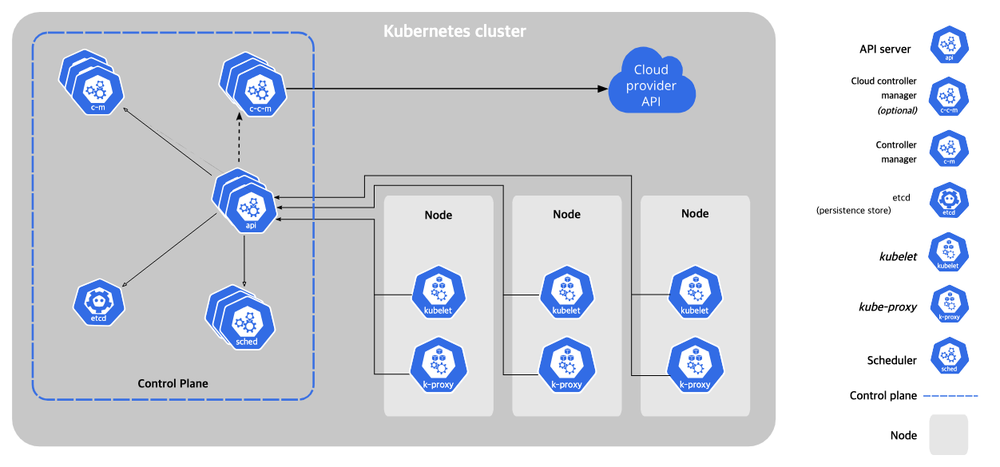

## 개요

쿠버네티스를 배포하면 클러스터가 형성되는데, 이 클러스터는 여러 컴포넌트로 구성된다.

이 문서에서는 쿠버네티스의 주요 컴포넌트에 대해 정리한다.

## 컨트롤 플레인 컴포넌트

> 클러스터에 관한 전반적인 결정(스케줄링 등)을 수행하고 클러스터 이벤트(디플로이먼트의 replicas 필드에 대한 요구 조건이 충족되지 않을 경우 새로운 파드를 구동시키는 것 등)를 감지하고 반응하는 컴포넌트.

### kube-apiserver

API 서버는 쿠버네티스 API를 노출하는 쿠버네티스 컨트롤 플레인 컴포넌트이다. API 서버는 쿠버네티스 컨트롤 플레인의 프론트 엔드이다.

쿠버네티스 API 서버의 주요 구현은 [kube-apiserver](https://kubernetes.io/docs/reference/command-line-tools-reference/kube-apiserver/) 이다. kube-apiserver는 수평으로 확장되도록 디자인되었다. 즉, 더 많은 인스턴스를 배포해서 확장할 수 있다. 여러 kube-apiserver 인스턴스를 실행하고, 인스턴스간의 트래픽을 균형있게 조절할 수 있다.

### etcd

모든 클러스터 데이터를 담는 쿠버네티스 뒷단의 저장소로 사용되는 일관성·고가용성 key-value 저장소.

### kube-scheduler

노드가 배정되지 않은 새로 생성된 파드 를 감지하고, 실행할 노드를 선택하는 컨트롤 플레인 컴포넌트.

### kube-controller-manager

컨트롤러 프로세스를 실행하는 컨트롤 플레인 컴포넌트.

아래 항목을 포함하고있다.

- 노드 컨트롤러: 노드가 다운되었을 때 통지와 대응에 관한 책임을 가진다.
- 잡 컨트롤러: 일회성 작업을 나타내는 잡 오브젝트를 감시한 다음, 해당 작업을 완료할 때까지 동작하는 파드를 생성한다.
- 엔드포인트슬라이스 컨트롤러: (서비스와 파드 사이의 연결고리를 제공하기 위해) 엔드포인트슬라이스(EndpointSlice) 오브젝트를 채운다
- 서비스어카운트 컨트롤러: 새로운 네임스페이스에 대한 기본 서비스어카운트(ServiceAccount)를 생성한다.

### cloud-controller-manager

클라우드별 컨트롤 로직을 포함하는 쿠버네티스 컨트롤 플레인 컴포넌트이다. 클라우드 컨트롤러 매니저를 통해 클러스터를 클라우드 공급자의 API에 연결하고, 해당 클라우드 플랫폼과 상호 작용하는 컴포넌트와 클러스터와만 상호 작용하는 컴포넌트를 구분할 수 있게 해 준다.

---

## 노드 컴포넌트

> 노드 컴포넌트는 동작 중인 파드를 유지시키고 쿠버네티스 런타임 환경을 제공하며, 모든 노드 상에서 동작한다.

### kubelet

클러스터의 각 노드에서 실행되는 에이전트. Kubelet은 파드에서 컨테이너가 확실하게 동작하도록 관리한다.

### kube-proxy

kube-proxy는 클러스터의 각 노드에서 실행되는 네트워크 프록시로, 쿠버네티스의 서비스 개념의 구현부이다.

kube-proxy는 노드의 네트워크 규칙을 유지 관리한다. 이 네트워크 규칙이 내부 네트워크 세션이나 클러스터 바깥에서 파드로 네트워크 통신을 할 수 있도록 해준다.

### container runtime

컨테이너 런타임은 컨테이너 실행을 담당하는 소프트웨어이다.

쿠버네티스는 containerd, CRI-O와 같은 컨테이너 런타임 및 모든 Kubernetes CRI (컨테이너 런타임 인터페이스) 구현체를 지원한다.

## 애드온

애드온은 쿠버네티스 리소스(데몬셋, 디플로이먼트 등)를 이용하여 클러스터 기능을 구현한다. 이들은 클러스터 단위의 기능을 제공하기 때문에 애드온에 대한 네임스페이스 리소스는 kube-system 네임스페이스에 속한다.

### DNS

여타 애드온들이 절대적으로 요구되지 않지만, 많은 예시에서 필요로 하기 때문에 모든 쿠버네티스 클러스터는 클러스터 DNS를 갖추어야만 한다.

클러스터 DNS는 구성환경 내 다른 DNS 서버와 더불어, 쿠버네티스 서비스를 위해 DNS 레코드를 제공해주는 DNS 서버다.

쿠버네티스에 의해 구동되는 컨테이너는 DNS 검색에서 이 DNS 서버를 자동으로 포함한다.

### Web UI (Dashboard)

대시보드는 쿠버네티스 클러스터를 위한 범용의 웹 기반 UI다. 사용자가 클러스터 자체뿐만 아니라, 클러스터에서 동작하는 애플리케이션에 대한 관리와 문제 해결을 할 수 있도록 해준다.

### Container Resource Monitoring

컨테이너 리소스 모니터링은 중앙 데이터베이스 내의 컨테이너들에 대한 포괄적인 시계열 매트릭스를 기록하고 그 데이터를 열람하기 위한 UI를 제공해 준다.

### Cluster-level Logging

클러스터-레벨 로깅 메커니즘은 검색/열람 인터페이스와 함께 중앙 로그 저장소에 컨테이너 로그를 저장하는 책임을 진다.

다음

## 참고

- [쿠버네티스 용어 정리](https://kubernetes.io/ko/docs/reference/glossary/?all=true#term-control-plane)
