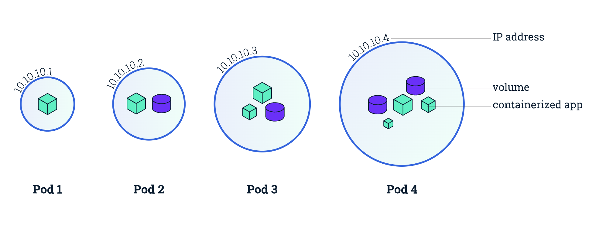

## 개요



> 파드(Pod) 는 쿠버네티스에서 생성하고 관리할 수 있는 배포 가능한 가장 작은 컴퓨팅 단위이다.

파드는 애플리케이션 별 "논리 호스트"를 모델링한다.
여기에는 상대적으로 밀접하게 결합된 하나 이상의 애플리케이션 컨테이너가 포함된다.
클라우드가 아닌 콘텍스트에서, 동일한 물리 또는 가상 머신에서 실행되는 애플리케이션은 동일한 논리 호스트에서 실행되는 클라우드 애플리케이션과 비슷하다.

일반적으로 파드는 직접 생성하지 않고, 디플로이먼트(Deployment) 또는 잡(Job)과 같은 워크로드 리소스를 사용하여 생성한다.
파드가 상태를 추적해야 한다면, 스테이트풀셋(StatefulSet) 리소스를 고려한다.

쿠버네티스 클러스터의 파드는 두 가지 주요 방식으로 사용된다.

- `단일 컨테이너를 실행하는 파드`: "파드 당 하나의 컨테이너" 모델은 가장 일반적인 쿠버네티스 유스케이스이다. 이 경우, 파드를 단일 컨테이너를 둘러싼 래퍼(wrapper)로 생각할 수 있다. 쿠버네티스는 컨테이너를 직접 관리하는 대신 파드를 관리한다.
- `함께 작동해야 하는 여러 컨테이너를 실행하는 파드`: 파드는 밀접하게 결합되어 있고 리소스를 공유해야 하는 함께 배치된 여러 개의 컨테이너로 구성된 애플리케이션을 캡슐화할 수 있다. 이런 함께 배치된 컨테이너는 하나의 결합된 서비스 단위를 형성한다. 예를 들어, 하나의 컨테이너는 공유 볼륨에 저장된 데이터를 퍼블릭에 제공하는 반면, 별도의 사이드카 컨테이너는 해당 파일을 새로 고치거나 업데이트한다. 파드는 이러한 컨테이너, 스토리지 리소스, 임시 네트워크 ID를 단일 단위로 함께 래핑한다.

### Shared Resources

- 볼륨과 같은, 공유 스토리지
- 클러스터 IP 주소와 같은, 네트워킹
- 컨테이너 이미지 버전 또는 사용할 특정 포트와 같이, 각 컨테이너가 동작하는 방식에 대한 정보

## Lifecycle

### Pod Phase

```kroki type=d2
direction: right
vars: {
    d2-config: {
      sketch: true
    }
}
Pending -> Running -> Succeeded
Running -> Failed
```

| 단계      | 설명                                                                                                                  |
| --------- | --------------------------------------------------------------------------------------------------------------------- |
| Pending   | 파드가 생성되었지만, 아직 노드에 스케줄되지 않았거나, 컨테이너 이미지를 다운로드하는 등의 준비 작업을 수행 중인 상태. |
| Running   | 파드가 노드에 스케줄되었고, 모든 컨테이너가 생성되어 실행 중인 상태.                                                  |
| Succeeded | 파드 내의 모든 컨테이너가 성공적으로 종료되었고, 더 이상 재시작되지 않을 상태.                                        |
| Failed    | 파드 내의 컨테이너 중 하나 이상이 실패로 종료되었고, 파드의 restartPolicy에 따라 재시작되지 않을 상태.                |
| Unknown   | 파드의 상태를 확인할 수 없는 상태. 이는 일반적으로 노드와의 통신 문제로 인해 발생할 수 있음.                          |

### Container States

전체 파드의 단계뿐 아니라, 쿠버네티스는 파드 내부의 각 컨테이너 상태를 추적한다.
| 상태 | 설명 |  
| ---------- | ----------------------------------------------------------------------------------------------------------------------------------------------------------------------------------------------------------------------------------------------------------- |  
| Waiting | 컨테이너가 실행되기 위해 필요한 작업을 기다리는 상태. (이미지 다운로드, 시크릿 적용 등) |  
| Running | 컨테이너가 정상적으로 실행 중인 상태. |  
| Terminated | 컨테이너가 종료된 상태. 종료 코드, 종료 신호 등의 정보를 포함. |

### Restart Policy

파드의 spec 에는 restartPolicy 필드가 있다. 사용 가능한 값은 Always, OnFailure 그리고 Never이다. 기본값은 Always이다.

restartPolicy 는 파드의 모든 컨테이너에 적용된다. restartPolicy 는 동일한 노드에서 kubelet에 의한 컨테이너 재시작만을 의미한다. 파드의 컨테이너가 종료된 후, kubelet은 5분으로 제한되는 지수 백오프 지연(10초, 20초, 40초, …)으로 컨테이너를 재시작한다. 컨테이너가 10분 동안 아무런 문제없이 실행되면, kubelet은 해당 컨테이너의 재시작 백오프 타이머를 재설정한다.

### Pod conditions

파드는 하나의 PodStatus를 가지며, 그것은 파드가 통과했거나 통과하지 못한 PodConditions 배열을 가진다. kubelet은 다음 PodConditions를 관리한다.

#### Pod conditions

| 필드               | 타입   | 설명                                                                                        |
| ------------------ | ------ | ------------------------------------------------------------------------------------------- |
| type               | string | 컨디션의 타입을 나타냅니다. (예: `PodScheduled`, `Ready`, `ContainersReady`, `Initialized`) |
| status             | string | 컨디션의 상태를 나타냅니다. `True`, `False`, 또는 `Unknown` 중 하나의 값을 가집니다.        |
| lastProbeTime      | string | 컨디션이 마지막으로 프로브된 시간을 나타냅니다.                                             |
| lastTransitionTime | string | 컨디션의 상태가 마지막으로 변경된 시간을 나타냅니다.                                        |
| reason             | string | 컨디션 상태 변경의 이유를 나타내는 짧은 코드입니다.                                         |
| message            | string | 컨디션 상태 변경에 대한 자세한 설명을 제공합니다.                                           |

```yaml showLineNumbers {2-22}
status:
  conditions:
    - lastProbeTime: null
      lastTransitionTime: "2024-10-26T10:00:05Z"
      reason: PodScheduled
      status: "True"
      type: PodScheduled
    - lastProbeTime: null
      lastTransitionTime: "2024-10-26T10:00:05Z"
      message: "containers with healthy status: [my-container]"
      reason: ContainersReady
      status: "True"
      type: ContainersReady
    - lastProbeTime: null
      lastTransitionTime: "2024-10-26T09:59:50Z"
      status: "True"
      type: Initialized
    - lastProbeTime: null
      lastTransitionTime: "2024-10-26T10:00:00Z"
      message: "containers with unready status: [my-container]"
      reason: ContainersNotReady
      status: "False"
      type: Ready
  containerStatuses:
    - containerID: docker://abcdefghijklmnopqrstuvwxyz1234567890
      image: my-image:latest
      imageID: docker-pullable://my-image@sha256:abcdefghijklmnopqrstuvwxyz1234567890
      lastState: {}
      name: my-container
      ready: false
      restartCount: 0
      started: false
      state:
        waiting:
          reason: "CreateContainerConfigError"
  hostIP: 10.1.2.3
  phase: Running
  podIP: 10.123.45.67
  podIPs:
    - ip: 10.123.45.67
  qosClass: BestEffort
  startTime: "2024-10-26T09:59:50Z"
```

#### Pod conditions type

| 컨디션          | 설명                                                                                                                                                                                 |
| --------------- | ------------------------------------------------------------------------------------------------------------------------------------------------------------------------------------ |
| PodScheduled    | 파드가 노드에 스케줄되었는지 여부를 나타냅니다.                                                                                                                                      |
| ContainersReady | 파드 내의 모든 컨테이너가 준비되었는지 여부를 나타냅니다. 모든 컨테이너가 실행 중이고, readiness 프로브를 통과했음을 의미합니다.                                                     |
| Initialized     | 모든 init 컨테이너가 성공적으로 완료되었는지 여부를 나타냅니다. init 컨테이너는 파드 내의 메인 컨테이너가 시작되기 전에 실행되는 컨테이너로, 필요한 초기화 작업을 수행합니다.        |
| Ready           | 파드가 요청을 처리할 준비가 되었는지 여부를 나타냅니다. readiness 프로브를 통과한 컨테이너가 하나 이상 있음을 의미합니다. 서비스에 연결되어 트래픽을 받을 수 있는 상태를 나타냅니다. |

## 특수 목적 컨테이너

### Init Container

**초기화 컨테이너는 파드의 앱 컨테이너들이 실행되기 전에 실행되는 특수한 컨테이너이다.** 초기화 컨테이너는 앱 이미지에는 없는 유틸리티 또는 설정 스크립트 등을 포함할 수 있다.

Docker 이미지에서의 entrypoint.sh 와 유사한 역할을 한다고 생각하면 된다.

| 특징      | 초기화 컨테이너 (Init Container)                              | 일반 컨테이너 (App Container)                                  |
| --------- | ------------------------------------------------------------- | -------------------------------------------------------------- |
| 실행 시점 | 파드 내 다른 컨테이너 시작 전, 순차적으로 실행                | 파드 내 초기화 컨테이너 완료 후 실행                           |
| 실행 목표 | 완료를 목표로 실행 (성공적으로 종료되어야 함)                 | 계속 실행 (애플리케이션 유지)                                  |
| 상태 검사 | `livenessProbe`, `readinessProbe`, `startupProbe` 지원 안 함  | `livenessProbe`, `readinessProbe`, `startupProbe` 지원         |
| 주요 목적 | 애플리케이션 컨테이너의 사전 조건 충족 (설정, 데이터 준비 등) | 애플리케이션 실행                                              |
| 격리 수준 | 앱 컨테이너와 다른 파일 시스템 뷰, 권한 설정 가능             | 파드 내 다른 컨테이너와 자원 공유 (볼륨 등)                    |
| 멱등성    | 멱등성 보장 필요 (재시작, 재시도 가능성 고려)                 | 멱등성이 필수는 아니지만, 애플리케이션의 특성에 따라 고려 필요 |

### Sidecar Container

**사이드카 컨테이너는 `Init Container` 의 특수한 케이스로 Kubernetes 파드 안에서 메인 앱 컨테이너와 함께 돌아가는 보조 컨테이너.**

메인 앱에 필요한 추가 기능을 쉽게 붙일 수 있다.

독립적인 라이프사이클을 가지고 있어서 앱 컨테이너와 독립적으로 시작, 중지 및 재시작할 수 있다.

```yaml showLineNumbers {15-22}
apiVersion: batch/v1
kind: Job
metadata:
  name: myjob
spec:
  template:
    spec:
      containers:
        - name: myjob
          image: alpine:latest
          command: ["sh", "-c", 'echo "logging" > /opt/logs.txt']
          volumeMounts:
            - name: data
              mountPath: /opt
      initContainers:
        - name: logshipper
          image: alpine:latest
          restartPolicy: Always
          command: ["sh", "-c", "tail -F /opt/logs.txt"]
          volumeMounts:
            - name: data
              mountPath: /opt
      restartPolicy: Never
      volumes:
        - name: data
          emptyDir: {}
```

### Ephemeral Container

**문제 해결과 같이 사용자 주도의 작업을 위해 기존 파드 내에서 일시적으로 실행되는 컨테이너**

디버깅할때 `kubectl exec` 명령어만으로 부족할때 Crashed 난 컨테이너를 진단할 때 사용됨.

## Namespace

**컨테이너 내부에서 보이는 사용자와 호스트 시스템의 사용자를 분리해주는 리눅스 커널의 기능.**

컨테이너 내부에서는 사용자가 루트(UID 0)로 보이더라도, 호스트 시스템에서는 실제 다른 사용자로 매핑될 수 있다.

- `향상된 보안`: 컨테이너가 루트로 실행되더라도 호스트 시스템에서는 권한이 없는 사용자로 실행되므로, 컨테이너 탈출로 인한 잠재적 손상을 줄일 수 있습니다.
- `권한 격리`: 각 파드의 사용자를 호스트의 서로 다른 사용자에게 매핑하여 다른 파드에 대한 잠재적 영향을 줄입니다.
- `스테이트리스 파드에 적합`: 사용자 네임스페이스는 특히 스테이트리스 파드에서 유용하며, 호스트의 보안을 강화하는 데 기여합니다.

```yaml showLineNumbers {6}
apiVersion: v1
kind: Pod
metadata:
  name: my-pod
spec:
  hostUsers: false
  containers:
    - name: my-container
      image: my-image
```

## Downward API

**파드 및 컨테이너 필드를 노출하는 기능**

환경변수와 볼륨 파일을 이용하는 방법이 있다.

자세한 내용은 아래 레퍼런스 참고.

---

---

## 참고

- [파드 | Kubernetes](https://kubernetes.io/ko/docs/concepts/workloads/pods/)
- [파일로 컨테이너에 파드 정보 노출하기 | Kubernetes](https://kubernetes.io/ko/docs/tasks/inject-data-application/downward-api-volume-expose-pod-information/)
